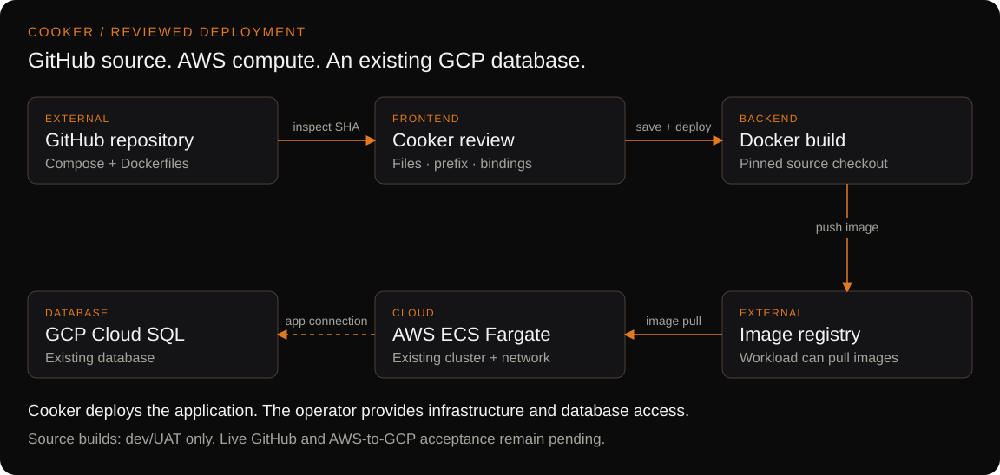

<div align="center">

# Cooker

**Visual pipelines and reviewed GitHub Compose deployments.**

Build container images, inspect the deployment graph, and ship to a configured runtime from a self-hosted Go + React application.

[](https://github.com/santapong/Cooker/actions/workflows/ci.yml)
[](backend/go.mod)
[](LICENSE)

[Get started](#get-started) · [Import from GitHub](#from-github-to-a-reviewed-deployment) · [Documentation](docs/README.md) · [Changelog](CHANGELOG.md)

</div>


> **Current status:** the GitHub Compose workflow and frontend improvements are on `develop`, ready for UAT. Human acceptance and live GitHub/cloud acceptance remain pending. These changes are **unreleased**; see the [implementation evidence](docs/plans/2026-09-06-github-compose-deployment.md#verification-record).

## Two ways to work

| Workflow | Use it for |
|---|---|
| **Pipelines** | Author a DAG with build, test, push, deploy, approval and custom stages. Follow execution and stage logs in the same graph. |
| **Apps** | Import a GitHub repository, choose Compose files, inspect Dockerfiles and services, save a reviewed revision, then deploy it. A single-Dockerfile entry is also available. |

The Porthole interface gives each stage type a distinct symbol. Shape identifies the action; colour communicates execution state. The interface includes keyboard focus handling, reduced-motion support and a persistent Calm mode.

## From GitHub to a reviewed deployment

1. **Repository:** select an administrator-approved GitHub App installation and repository, or enter a public `owner/repo`. Choose a branch or tag.
2. **Compose files:** pick the base file and ordered overrides discovered in that revision. Set profiles and explicit interpolation inputs.
3. **Preview:** render services and dependencies; inspect build contexts, Dockerfiles, targets, ports, networks, volumes and masked configuration.
4. **Destination:** choose a prefix, image registry and configured compute target. Optionally bind a Compose database to an existing external database through a Cooker Environment.
5. **Review:** check workload names and diagnostics, then **Save app**. Start execution with **Deploy** on the App page.

The saved plan pins a full Git commit SHA. Branch updates require an explicit new inspection and review; reviewed Compose apps use manual deployment. Preview does not build or deploy anything.



[Interactive architecture](docs/images/github-compose.html) · [Setup and acceptance guide](docs/guides/GITHUB-COMPOSE-DEPLOYMENT.md) · [Execution internals](docs/reference/github-compose-architecture.md)

### Can the application run on AWS while its database is on GCP?

The implemented mapping supports an application on **existing ECS Fargate infrastructure** with a binding to an **existing GCP Cloud SQL database**. Cooker replaces the local database service with environment-key bindings and excludes that service from build/deployment.

The operator supplies AWS infrastructure, image access, credentials, TLS and a reachable database connection. Cooker does not provision EC2 VMs, Cloud SQL instances, cross-cloud networking or proxy sidecars. A successful rollout alone does not prove database connectivity; [live UAT](docs/guides/GITHUB-COMPOSE-DEPLOYMENT.md#uat-acceptance) must check the application-to-database path.

### What does “Compose registry” store?

| Surface | Stores | Scope |
|---|---|---|
| **Compose library** | Named references to Compose files readable by the backend | This browser |
| **GitHub stacks** | Saved Apps with their reviewed source, files, prefix and bindings | Server-backed; shared across browsers |
| **Image registry** | Container images built or consumed by deployments | Your configured registry |

OCI publishing/import of Compose bundles and immutable stack revision history are future work. See [Compose library and registries](docs/user-guide/guides/compose-library.md).

## Get started

### Explore the interface locally

Requires Git and Docker with Compose. From a new checkout:

```sh
git clone --branch develop https://github.com/santapong/Cooker.git
cd Cooker
docker compose up --build
```

Open **http://localhost:8080**. The default Compose file starts Cooker, PostgreSQL and Redis; the Go server serves both the API and the frontend. It does not start a Vite server on port 5173.

This development stack has authentication disabled and uses no-op build, push and deploy backends. It is useful for exploring the interface, but cannot complete real App deployments. Use it only in a trusted local environment. Stop it with `docker compose down`; add `-v` only when intentionally deleting its database volume.

### Exercise real builds and deployments

Follow the [quickstart](docs/user-guide/getting-started/quickstart.md) and [UAT runbook](docs/guides/UAT.md) before running:

```sh
make uat-up
```

The UAT stack includes a local registry and k3s. It requires host Docker access and registry configuration. GitHub App access and cloud destinations require additional operator setup.

**Current source-build constraint:** GitHub App builds require `COOKER_BUILDER=docker` and `COOKER_PUSHER=docker`. Production-mode validation rejects both backends, so this source-build path is currently for dev/UAT. Do not disable production safeguards to treat it as a production-ready path. Separately configured pipeline builders have different capabilities.

### Host Cooker

Use the [installation guide](docs/guides/INSTALL.md), [Helm guide](docs/user-guide/getting-started/helm-install.md) and [rollout playbook](docs/guides/ROLLOUT.md). Hosting the Cooker control plane and provisioning the infrastructure for your application are separate tasks.

## Supported App destinations

| Destination | Current behavior | Operator prerequisites |
|---|---|---|
| Docker on the Cooker host | Native Compose project, service DNS and named volumes | Docker daemon, CLI and Compose v2 |
| Kubernetes | Deployment and Service per supported Compose service | Working cluster credentials; `kubectl` or `clientgo` deployer |
| AWS ECS Fargate | One single-container service per executable Compose service | Existing cluster, network, IAM roles and image pull access |
| Google Cloud Run | Explicit adapter for the supported single-container subset | Configured project, region and credentials |

The wizard reports unavailable targets and unsupported Compose fields before deployment. One compute target and one replica per service are supported. Remote Docker host selection, cloud volume translation, cloud service discovery, ingress and sidecar grouping are not implemented in this flow. Other adapters in the repository do not imply App wizard support.

## Architecture and operations

Cooker serves a React 18 / TypeScript frontend and a Go 1.25 API on port 8080. PostgreSQL persists Apps, pipelines, environments and runs. Optional Redis backends support rate limiting, WebSocket tickets and broadcast fan-out.

- **Authentication:** local authentication and/or OIDC, with role-based permissions. The GitHub App connection supplies repository access; it is separate from user sign-in.
- **Secrets:** selectable database, KeepSave, Vault, AWS or GCP backends. External database bindings reference Environment key names.
- **Execution:** pluggable builders, pushers and deployers; per-stage logs, retries and approval gates. Capabilities vary by execution path and configuration.
- **Operations:** readiness/liveness probes, optional Prometheus metrics and OpenTelemetry tracing, and audit logging.

Read the [system design](docs/system-design/README.md), [environment variable reference](docs/user-guide/reference/env-vars.md), [auth guide](docs/user-guide/operations/auth-and-rbac.md) and [runbook](docs/guides/RUNBOOK.md).

## Development and checks

Requires Go 1.25 and Node.js 20 or later. Install frontend dependencies with `npm ci` in `frontend/`.

```sh
# From backend/
go build ./...
go vet ./...
go test -race -timeout 120s ./...

# From frontend/
npm test
npm run lint
npm run build
npx playwright install chromium
npm run test:e2e
```

The implementation record includes 178 frontend tests, 32 browser checks, backend race tests and a disposable PostgreSQL migration check. These are recorded local results, not live cloud acceptance or a claim that current CI is green. The implementation check also found 31 Go lint findings in unchanged files; see the [verification record](docs/plans/2026-09-06-github-compose-deployment.md#verification-record).

Set `COOKER_INTEGRATION_DATABASE_URL` to a disposable PostgreSQL database to exercise prefix persistence; see the [verification procedure](docs/guides/GITHUB-COMPOSE-DEPLOYMENT.md#repeatable-local-verification). Preserve the pinned Go module set; do not run `go mod tidy` as a routine documentation step.

| Directory | Purpose |
|---|---|
| `backend/` | API, services, adapters, stores and migrations |
| `frontend/` | React application, unit tests and Playwright checks |
| `deploy/` | Container, Kubernetes, Helm and cloud deployment assets |
| `docs/` | User guides, architecture, UAT, plans and references |
| `docs/images/` | SVG illustrations, editable sources and architecture viewer |

## Documentation and contribution

Start at the [documentation index](docs/README.md). For changes, read [CONTRIBUTING.md](CONTRIBUTING.md), use `develop` for integration and keep release work on `main`. Report vulnerabilities through [SECURITY.md](SECURITY.md).

Cooker is licensed under [Apache 2.0](LICENSE).
