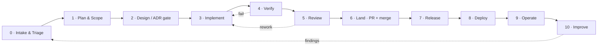

# Cooker — Application Development Life Cycle (ADLC)

How a change gets from idea to running in production, and **which part of the Claude Code harness drives each phase**.

Cooker is built by a human maintainer plus a fleet of Claude Code agents, skills, and workflows (the *harness* — see [`harness-engineering.md`](harness-engineering.md)). This document is the contract between them: it names the phases, the gate that lets a change leave each phase, and the agent/skill/workflow that owns the work inside it.

> If you only read one thing: the ADLC is a **loop**, not a line. Audits and the weekly cron feed findings back into Intake. The honest production-readiness verdict and open work live in [`../../backlog.md`](../../backlog.md); the hard rules every phase must respect live in [`../../CLAUDE.md`](../../CLAUDE.md).

---

## The loop



## Phases at a glance

| # | Phase | Primary harness driver | Gate to exit (what must be true to move on) |
|---|---|---|---|
| 0 | **Intake & Triage** | maintainer + routing (this doc's §"Router") | The change has a type (bug / feature / audit-finding / CI-failure / chore) and a target branch. |
| 1 | **Plan & Scope** | `cooker-planner` agent | A written plan: critical files, approach, sequencing, risks, verification, out-of-scope. |
| 2 | **Design / ADR** | `cooker-planner` → `docs/adr/` | For ADR-gated items: an accepted mini-ADR picking the mechanism. Skipped for routine changes. |
| 3 | **Implement** | `cooker-feature-dev` → layer agents; skills `cooker-new-feature` / `cooker-improve` / `cooker-fix-bug` | One commit per layer, on the feature branch, following §11 of [`design.md`](../reference/design.md). |
| 4 | **Verify** | layer agents + `check-pkg.sh`; skills `verify` / `run` | `make test` (or the scoped command) green locally; manual end-to-end check where behaviour changed. |
| 5 | **Review** | skill `code-review`; `cooker-security` agent; workflow `cooker-review` | Confirmed findings triaged; security pass done if auth/secrets/Dockerfile touched. |
| 6 | **Land** | maintainer + GitHub MCP | Draft PR → CI green (backend, frontend, docker) → squash-merge to `main`; backlog + docs updated **in the same PR**. |
| 7 | **Release** | skill-less; [`RELEASING.md`](../guides/RELEASING.md) | Tagged release, signed artifact (Ed25519), `CHANGELOG.md` entry. |
| 8 | **Deploy** | Helm chart / raw K8s; `Config.Validate` | Rolled out across Dev → Staging → Production via promotions; boot guards pass. |
| 9 | **Operate** | [`RUNBOOK.md`](../guides/RUNBOOK.md); `/metrics`; audit log | Alerts wired; degradation observable; incidents have a runbook entry. |
| 10 | **Improve** | skills `cooker-audit` / `cooker-weekly`; workflow `cooker-audit-sweep` | Findings filed back into Intake; `chain-recheck.md` reflects reality. |

The rest of this doc is one section per phase: **trigger → driver → inputs → outputs → exit gate → hard rules**.

---

## 0 · Intake & Triage

**Trigger.** A request lands: a GitHub issue, an owner request (see `backlog.md` "Owner-requested"), an audit finding ID (`[A<n>-<m>]` / `[B.X.Y]`), a CI failure (`<github-webhook-activity>` event), a PR review comment, or the weekly cron firing.

**Driver.** The maintainer (or the routing rules below). The first job is to *classify* the change, because the change type selects which phases apply — most changes skip phases.

**Router — pick the lightest path that fits:**

| If the change is… | Skill to open first | Phases that apply |
|---|---|---|
| "Where is X?" / "how does Y work?" | `cooker-find` | 0 only (it's a question) |
| A reproducible bug / stack trace / failing test | `cooker-fix-bug` | 0 → 3 → 4 → 5 → 6 |
| "Improve / refactor / close audit finding / fix theme T\<n\>" | `cooker-improve` | 0 → (1) → 3 → 4 → 5 → 6 |
| A new user-facing capability | `cooker-new-feature` | 0 → 1 → (2) → 3 → 4 → 5 → 6 |
| "Find bugs / audit X / is this safe?" | `cooker-audit` | 0 → 10 (produces findings, not code) |
| "Why is CI red?" | `cooker-ci-debug` | 0 → 4/6 (fix the failing step) |
| The Monday cron | `cooker-weekly` | 0 → picks one item → runs its path |
| Open-ended "what should we build / sequence the backlog" | `cooker-planner` | 0 → 1 (plan only) |

**Exit gate.** The change has (a) a type, (b) a target branch name (`claude/<topic>` or `<area>/<topic>`), and (c) a confirmation it isn't already done — `cooker-find` / `cooker-new-feature` §1 catch "this already exists under a different name", which is half of all feature requests.

**Hard rules.** Don't pick `roadmap` / `needs-design` items for a routine path — they go through Plan/Design first. Don't start Phase-0 security hot-fixes (themes T1/T2/T3/T5) without asking the maintainer.

---

## 1 · Plan & Scope

**Trigger.** Anything that isn't a one-file mechanical change: a feature, a cross-layer audit-finding closure, a sequencing question.

**Driver.** The **`cooker-planner`** agent (read-only, runs on `opus`). It never edits code — it returns a written plan the implementer agents execute.

**Inputs (the planner's required reading).** `CLAUDE.md`, `backlog.md`, `docs/reference/architecture.md`, `docs/reference/design.md` §11, the relevant `docs/audits/` doc, and `SECURITY.md` when auth/secrets/CORS/Dockerfile are in scope.

**Output.** A dense plan with these sections: **Context · Critical files (absolute paths, grouped by layer) · Approach · Sequencing · Risks & rollback · Verification (paste-able commands) · Out of scope.** Plans over ~600 words mean the scope is too big — split it.

**Exit gate.** Every file to be touched has a path and a one-line reason; every unknown is either resolved by a referenced doc or listed as a question for the maintainer; the plan can be handed to a layer agent without further clarification.

**Hard rules.** The planner enforces the `CLAUDE.md` "What NOT to do without asking" list at plan time — so a forbidden approach (re-add `Allow-Credentials`, bind-mount `docker.sock`, flip OIDC on in UAT, bump Go off its pin, add a handler field without a migration) never reaches implementation.

---

## 2 · Design / ADR gate

**Trigger.** The change picks a mechanism that's expensive to reverse: a new traffic-routing scheme, a credential blast radius, a schema shape that locks in a query pattern, a new public API surface. The backlog flags these explicitly — e.g. **OR-1** (canary deploy) and **OR-2** (cloud-resource management) are `needs-ADR` / `ADR-gated`.

**Driver.** `cooker-planner` drafts; the decision is recorded as an ADR in [`docs/adr/`](../adr/README.md).

**Output.** A mini-ADR: the decision, the alternatives considered, the chosen mechanism, and the scope guard. Each phase of an XL item (e.g. OR-2's read-only → safe-lifecycle → broad-management phasing) gets its **own** ADR.

**Exit gate.** The ADR is accepted and links the backlog item. Routine changes **skip this phase** — don't ADR-gate a bug fix.

---

## 3 · Implement

**Trigger.** An approved plan (or a routed bug/improvement that didn't need one).

**Driver.** The **`cooker-feature-dev`** coordinator (opus) for anything spanning layers; it delegates to the layer specialists in parallel:

| Layer | Agent |
|---|---|
| Store + migration | `cooker-backend-data` |
| Handler + service + middleware | `cooker-backend-api` |
| Builder / pusher / deployer / secrets backend / stage type | `cooker-backend-adapters` |
| Zustand store + api client + WS + OIDC helpers | `cooker-frontend-state` |
| Pages + components | `cooker-frontend-ui` |
| Helm / K8s / Dockerfile / UAT compose | `cooker-infra-deploy` |
| CI / Makefile / workflow YAML | `cooker-infra-ci` |
| Auth / secrets / threat-model / `SECURITY.md` | `cooker-security` |

Single-layer work can skip the coordinator and go straight to the layer agent. The governing skill is `cooker-new-feature` (new capability), `cooker-improve` (refactor / known-finding), or `cooker-fix-bug` (defect).

**Commit discipline (from `cooker-new-feature` §4).** One commit per layer, in dependency order so each stands alone:

1. Schema migration — `new-migration.sh <slug>` → `NNN_<slug>.up.sql` **and** `.down.sql`; NOT-NULL columns get a DEFAULT (rolling-deploy safety).
2. Model + store — memory **and** postgres impls together (the `store.go` interface gates both).
3. Validate + business logic — new `internal/validate/` constants + `internal/service/` logic; executor switch arm for a new stage type.
4. Adapter (if pluggable) — new file implementing the interface + a constructor case in `selectXxx` in `server.go`.
5. Handler + route — `internal/handler/<domain>.go` + route in `internal/server/router.go`, with the right `RequireRole(...)`.
6. Frontend (if user-facing) — api client method + store + page, **in the same commit** so the SPA is never half-wired.
7. Helm (if it changes deployment) — values block, template, RBAC.
8. Tests — interleaved with each layer, not bolted on at the end.
9. Docs — `architecture.md` for a new component, `design.md` §11 for a new template-worthy pattern, `.env.uat.example` + `docs/guides/UAT.md` for a new env var.

**Exit gate.** Every layer's commit is on the feature branch; no business logic in handlers; no HTTP types in services; no `panic` outside startup; new env vars have a `Config.Validate` gate; a new handler request field has a matching migration **in the same PR**.

---

## 4 · Verify

**Trigger.** Each layer commit; then the whole change before review.

**Driver.** Each layer agent self-verifies; the human-facing `verify` / `run` skills confirm behaviour in the running app.

**Commands (mirror CI locally — never wait for CI to catch a test failure):**

```bash
# Scoped inner loop (one package):
.claude/skills/cooker-improve/check-pkg.sh internal/<pkg>   # gofmt + go vet + go test -race

# Full backend:
cd backend && gofmt -l . && go vet ./... && go test ./... -race

# Frontend:
cd frontend && npm run lint && npm run build && npm test   # tsc --noEmit runs in build

# Deploy artifacts (helm gate is P6.1 — run it locally even though it isn't a CI job yet):
helm lint deploy/helm/cooker && helm template deploy/helm/cooker | kubeconform -strict

# Everything:
make test
```

**Exit gate.** All of the above green locally; for behaviour changes, a manual end-to-end check (`make uat-up`, exercise the path). The race detector is non-negotiable — it's on in CI.

---

## 5 · Review

**Trigger.** Implementation + verify are green; before flipping the PR to "ready".

**Driver.**
- The **`code-review`** skill for the working diff (correctness bugs + simplification).
- The **`cooker-security`** agent whenever the diff touches auth, secrets, CORS, the rate limiter, NetworkPolicy, or the Dockerfile.
- For a diff-wide, multi-dimension pass, the **`cooker-review`** workflow (see [`harness-engineering.md`](harness-engineering.md) and the [`/loop-engine`](../../.claude/skills/loop-engine/SKILL.md) skill): it fans out reviewers over {bugs, layering, security, migration-safety}, **adversarially verifies each finding**, and synthesizes a go/no-go.

**Exit gate.** Confirmed findings are either fixed (loop back to Phase 3) or consciously deferred with a backlog entry. A security-relevant diff has a `cooker-security` sign-off and a `SECURITY.md` update if the threat model moved.

**Hard rules.** Don't write the fix *inside* the audit/review output — findings and fixes are separate steps (keeps the audit reading-flow clean). Don't fabricate severity; default uncertain findings to Medium and flag the uncertainty.

---

## 6 · Land (PR + merge)

**Trigger.** Review clean.

**Driver.** Maintainer, via the GitHub MCP tools (`mcp__github__*`). All PR/CI/comment interaction goes through the MCP server — there is no `gh` CLI in the web/remote environment.

**Steps.**
1. `git push -u origin <branch>` (retry with exponential backoff on network errors).
2. Open a **draft** PR — always draft first; flip to ready only after CI is green. Title: `feat(<area>): …` / `fix(<area>): …` / `docs: …` (conventional commits; we squash-merge).
3. PR body: the requirement/issue, an acceptance-criteria test-plan checklist, new env vars / Helm values / migration numbers, and a **rollout-notes** section if it isn't backwards-compatible.
4. CI runs the three jobs — backend (`build → vet → test -race` against Postgres), frontend (`ci → lint → build → test`), docker (`docker build`). A `helm lint`/`kubeconform` gate is **P6.1, pending**; run it locally meanwhile.
5. On green, squash-merge to `main`.

**Same-PR housekeeping (don't split these out):**
- Move the `backlog.md` item from its priority section into "Closed" with the merged PR number.
- Update the audit doc (`- [ ]` → `- [x]` / `**Open**` → `**Closed by …**`) when closing a finding.
- Update `SECURITY.md` (auth/secrets/Dockerfile) and `docs/guides/UAT.md` (UAT behaviour) if touched.

**Hard rules.** Never push to `main` directly. One PR per logical change. DCO sign-off on every commit (`git commit -s`); inbound = outbound under Apache-2.0.

---

## 7 · Release

**Trigger.** `main` has accumulated a shippable set of changes.

**Driver.** [`docs/guides/RELEASING.md`](../guides/RELEASING.md).

**Output.** A tagged release with a signed artifact (Ed25519 licensing, landed in PR #117), a `CHANGELOG.md` entry, and verification per [`SECURITY-RELEASE-VERIFY.md`](../guides/SECURITY-RELEASE-VERIFY.md).

**Exit gate.** The artifact is signed and the signature verifies; the changelog reflects the diff since the last tag.

---

## 8 · Deploy

**Trigger.** A release (or a continuous-deploy trigger) targets an environment.

**Driver.** The Helm chart (`deploy/helm/cooker/`) or the raw K8s manifests (`deploy/kubernetes/`), promoted across **Dev → Staging → Production**. Cooker dogfoods its own promotion model here.

**Boot guards (`Config.Validate`) — the deploy fails loudly rather than silently if:**
- `COOKER_ENV=production` with `BUILDER=docker` (use Kaniko).
- Multi-replica with memory backends and no sticky sessions (set `COOKER_STICKY_SESSIONS=true` or flip the WS hub / ticket store / rate limiter to Redis).
- A required env var for the selected backend is missing (e.g. KeepSave's `COOKER_SECRETS_KEEPSAVE_{URL,PROJECT_ID,API_KEY}`).
- Production + OIDC + ingress enabled with empty `ingress.tls` (the chart refuses to render).

**Exit gate.** The deployment-shape readiness matrix in `backlog.md` says ✅ for the chosen shape. Anything ❌ is refused at boot by design.

**Hard rules.** Don't bind-mount `/var/run/docker.sock` in any new context (P1.1 Kaniko closes that gap). Don't change `COOKER_ENV` defaults globally.

---

## 9 · Operate

**Trigger.** The change is serving traffic.

**Driver.** [`RUNBOOK.md`](../guides/RUNBOOK.md) for on-call; the `/metrics` endpoint (the four resilience metrics) and the audit log (`COOKER_AUDIT_DESTINATION`, optional Postgres-backed `/admin/audit` viewer) for observability.

**Exit gate.** Degradation is observable (metrics + alerts), and any new failure mode introduced by the change has a runbook entry. Per [`observability.md`](../user-guide/operations/observability.md).

---

## 10 · Improve (the feedback loop)

**Trigger.** Continuous: the Monday cron (`.github/workflows/cooker-weekly.yml`), an ad-hoc audit request, or an incident postmortem.

**Driver.**
- The **`cooker-audit`** skill for "find bugs / is this safe" — it encodes the 10 anti-patterns that produced real Cooker findings and the known-false-positive list, so it doesn't re-discover what's already catalogued.
- The **`cooker-weekly`** skill / cron — lands exactly one focused fix per week and leaves a visible trace.
- For a once-a-quarter or pre-launch deep sweep, the **`cooker-audit-sweep`** workflow — a multi-modal finder fan-out with adversarial verify, looped until two dry rounds.

**Output.** Findings written in the `vulnerabilities-and-chains.md` / `chain-recheck.md` format (severity + `file:line` + chain Trigger/Sequence/Effect/Mitigation). Novel chain-shaped findings get added to `chain-recheck.md`.

**Exit gate → back to Intake.** Each finding becomes a new Intake item with a type and a priority. The loop closes.

---

## Cross-cutting concerns (apply in every phase)

| Concern | Rule | Enforced by |
|---|---|---|
| **Governance** | The `CLAUDE.md` "What NOT to do without asking" list is binding in every phase. | `cooker-planner` (plan time), layer agents (implement time), `cooker-security` (review time). |
| **Security pass** | Any diff touching auth / secrets / CORS / rate limiter / NetworkPolicy / Dockerfile gets a `cooker-security` review + a `SECURITY.md` update. | Phase 5 gate. |
| **Docs-sync** | Current-state docs (`system-design/`, `reference/`) and `backlog.md` are updated in the **same PR** as the change. Proposals move to reference when they ship. | Phase 6 housekeeping. |
| **Store parity** | Memory and Postgres store impls never diverge. | `cooker-backend-data`; the `store.go` interface gates both. |
| **Least privilege** | New routes pick the tightest `RequireRole`; read-only agents have no Edit/Write tools. | Phase 3; harness design. |

---

## Worked example — a new pusher, end to end

> *"Add a pusher for GHCR with OIDC token auth."*

| Phase | What happens |
|---|---|
| 0 Intake | `cooker-find` + `cooker-new-feature` §1 confirm `internal/pusher/crane.go` doesn't already cover it. Type: feature. Branch `feature/pusher-ghcr-oidc`. |
| 1 Plan | `cooker-planner` returns: touch `internal/pusher/ghcr.go` (new), `selectPusher` in `server.go`, `.env.uat.example`, `docs/guides/UAT.md`; risk = token refresh; verify = contract test + a real push to a test GHCR repo. |
| 2 Design | No ADR — it's a new adapter behind an existing interface, fully reversible. Skip. |
| 3 Implement | `cooker-backend-adapters`: implement `Pusher`, add the `selectPusher` case, document the env-var value. One commit. |
| 4 Verify | `check-pkg.sh internal/pusher` green; contract test against the `Pusher` interface; a manual push via `make uat-up`. |
| 5 Review | `code-review` on the diff; `cooker-security` because it handles a registry credential. |
| 6 Land | Draft PR `feat(pusher): GHCR OIDC pusher`; CI green; squash-merge; `.env.uat.example` + UAT doc shipped in the same PR. |
| 7–9 | Rolls out with the next release; no new failure mode beyond "token expired" → runbook note. |
| 10 Improve | `cooker-audit` later sweeps the new adapter for the per-call-timeout and shell-injection patterns. |

---

## See also

- [`harness-engineering.md`](harness-engineering.md) — how the agents/skills/workflows that drive this lifecycle are built.
- [`../reference/design.md`](../reference/design.md) §11 — the canonical "adding a feature" checklist Phase 3 follows.
- [`../../CLAUDE.md`](../../CLAUDE.md) — orientation, hard rules, current state.
- [`../../backlog.md`](../../backlog.md) — what's open, what's closed, and the production-readiness verdict.
- [`../../.claude/skills/loop-engine/SKILL.md`](../../.claude/skills/loop-engine/SKILL.md) — the `/loop-engine` skill (TheLoopSkill) used in Phases 5 and 10; `--framework Cooker-AIDLC` runs this lifecycle.
