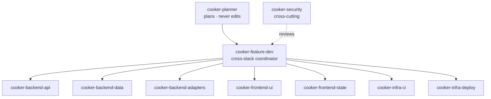
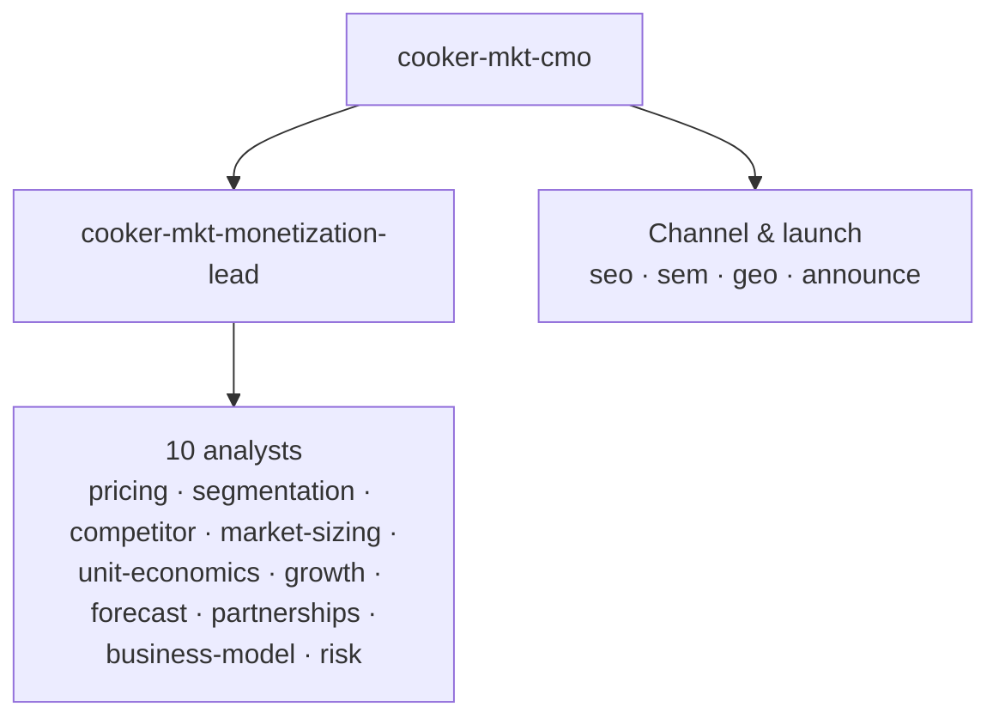

# Cooker — Harness Engineering

The `.claude/` directory turns Claude Code into a **Cooker-specialized engineering org**: a fleet of role-scoped agents, a library of procedural skills, and deterministic multi-agent workflows. This document explains the three primitives, when to reach for each, how the existing ones are built, and how to add a new one without breaking the conventions.

> The harness *drives* the lifecycle in [`ADLC.md`](ADLC.md); this doc is about the harness *itself* — how it's engineered and kept honest.

```
.claude/
├── agents/        26 role-scoped subagents (.md, frontmatter + body)
├── skills/        7 repo-authored cooker-* skills + vendored packs (12 loop-* from TheLoopSkill, 6 ponytail-*)
└── workflows/     deterministic multi-agent orchestration scripts (.js)
```

---

## The three primitives

| Primitive | What it is | Lives in | Context | Invoked by |
|---|---|---|---|---|
| **Skill** | A *procedure* — a routine you follow, optionally with helper scripts. | `.claude/skills/<name>/SKILL.md` | Runs in the **main** conversation (no separate window). | `/name`, or auto-triggered when the request matches its `description`. |
| **Agent** | A *role* — its own context window, its own tool allow-list, its own model. | `.claude/agents/<name>.md` | **Isolated** window per spawn. | The `Agent` tool (`subagent_type: "<name>"`). |
| **Workflow** | *Deterministic orchestration* — JavaScript that fans out agents with loops/barriers/conditionals. | `.claude/workflows/<name>.js` | Spawns many isolated agents; returns structured data. | The `Workflow` tool (`{name: "<name>"}`) — **opt-in only**. |

### Which one do I reach for?

| You want to… | Reach for | Why |
|---|---|---|
| Encode "the way we do X" so it's repeatable | **Skill** | Cheapest. No extra context window. The main loop just follows the steps. |
| Enforce deep, lane-specific conventions on one slice of work | **Agent** | A scoped role with its own tools/model enforces more than a prompt can. |
| Do independent work in parallel, or isolate a big read so it doesn't bloat the main context | **Agent** (one per task) | Each runs in its own window; only the conclusion comes back. |
| Be *comprehensive* (cover everything) or *confident* (verify before committing) at a scale one context can't hold | **Workflow** | Deterministic fan-out + adversarial verify + synthesis. |
| Run a routine on a schedule | **Skill + cron** | e.g. `cooker-weekly` + `.github/workflows/cooker-weekly.yml`. |

Rule of thumb: **skill first, agent when you need isolation or a different model, workflow only when the user opts in** (see the [`/loop-engine`](../../.claude/skills/loop-engine/SKILL.md) skill for the opt-in contract).

---

## The agent fleet (26 agents, two divisions)

### Delivery (10) — build and ship the product



| Agent | Model | Tools | Owns |
|---|---|---|---|
| `cooker-planner` | opus | Read, Bash, Grep, Glob, WebFetch | Scoping/sequencing. **Read-only** — outputs plans, never edits. |
| `cooker-feature-dev` | opus | +Agent | End-to-end features; delegates to layer agents in parallel. |
| `cooker-backend-api` | sonnet | Read/Edit/Write, Bash, Grep, Glob | `handler` / `service` / `server` — HTTP + business logic, strict layering. |
| `cooker-backend-data` | sonnet | same | `store/` — Postgres + memory parity, idempotent migrations. |
| `cooker-backend-adapters` | sonnet | same | `builder` / `pusher` / `deployer` / `deploytarget` / stage types. |
| `cooker-frontend-state` | sonnet | same | Zustand stores, api client, `useWebSocket`, OIDC helpers. |
| `cooker-frontend-ui` | sonnet | same | Pages + components, strict TS. |
| `cooker-infra-ci` | sonnet | same | `.github/workflows/`, Makefile, race-test discipline. |
| `cooker-infra-deploy` | sonnet | same | Helm, K8s manifests, Dockerfile, UAT compose. |
| `cooker-security` | sonnet | same | Auth/secrets/container hardening/threat-model + `SECURITY.md`. |

### Marketing & Monetization (16) — research-only, never touch product code



The CMO orchestrates; the monetization-lead runs the 10-analyst draft→critique→refine→synthesize loop. All 16 are read-only on code (`Read, Write, Grep, Glob, WebSearch, WebFetch`) and write only their analysis docs under `docs/marketing/`. They're a worked example of a **multi-tier agent hierarchy** living in the same repo as the delivery fleet.

---

## The skill library

### Repo-authored (7 `cooker-*` skills)

| Skill | Trigger | Phase it serves | Generic counterpart |
|---|---|---|---|
| `cooker-find` | "where is X / how does Y work" | Intake (navigation) | — |
| `cooker-audit` | "find bugs / is this safe" | Improve (findings) | `loop-review` |
| `cooker-fix-bug` | a stack trace / failing test / "X is broken" | Bug path | `loop-debug` |
| `cooker-improve` | "refactor / close finding / fix theme T\<n\>" | Improve | `loop-review` (find-only) |
| `cooker-new-feature` | "add a new \<thing\>" | Feature path | `loop-scout` + `loop-design` |
| `cooker-ci-debug` | "why is CI red" | Verify/Land | `loop-debug` |
| `cooker-weekly` | the Monday cron | Improve (cadence) | `loop-autopilot` |

### Vendored: TheLoopSkill (12 `loop-*` skills)

Copied from [santapong/TheLoopSkill](https://github.com/santapong/TheLoopSkill) per its INSTALL.md — pin, re-sync procedure, and the keep-verbatim rule live in [`.claude/skills/README.md`](../../.claude/skills/README.md). These are the **generic engineering routines**: `loop-engine` (author/run multi-agent workflows — replaced the retired repo-authored `workflow` skill; run with `--framework Cooker-AIDLC` for this repo's gated lifecycle), `loop-review`, `loop-debug`, `loop-test`, `loop-design`, `loop-docs`, `loop-audit`, `loop-research`, `loop-scout`, `loop-orchestrate`, `loop-harness`, `loop-autopilot`.

**Division of labour:** a `loop-*` skill carries the methodology; the matching `cooker-*` skill carries the project protocol on top of it (audit-corpus routing, chain-ledger bookkeeping, path heat-maps, the Monday cron contract). For generic work — or work in another repo — use the `loop-*` skill directly; for Cooker-specific routines the `cooker-*` skill remains the entry point and defers methodology to its counterpart.

### Vendored: ponytail (6 `ponytail-*` skills)

Minimalism/anti-over-engineering pack (see `.claude/skills/ponytail/VENDORED_FROM.md`). Deliberately kept alongside `loop-review`: `ponytail-review`/`ponytail-audit` hunt deletions at an aggressiveness `loop-review`'s quality bar explicitly filters out.

The harness also exposes built-in skills (`code-review`, `simplify`, `verify`, `run`, `deep-research`, …) — use those for general work, the `cooker-*` ones for Cooker-specific routines.

The single most important skill convention is the **"which skill when" table** — every skill that overlaps with siblings carries one (see `cooker-audit`'s). It's what keeps a request from triggering the wrong routine.

---

## Anatomy of a good agent

Every `.claude/agents/<name>.md` follows the same shape — copy an existing one (`cooker-backend-api.md` for a layer agent, `cooker-feature-dev.md` for a coordinator):

```markdown
---
name: cooker-<area>-<role>
description: <one line>. Trigger on "<phrase>", "<phrase>", or any change to <path>.
tools: Read, Edit, Write, Bash, Grep, Glob       # least privilege — omit Agent unless it coordinates
model: opus | sonnet                              # opus only for heavy reasoning
---
<!-- complexity: <high|medium|low> — <one-line justification> -->

# Cooker — <name> agent

## Mission                  one paragraph: what it ships, what it delegates
## Allowed paths            where it may edit
## Forbidden paths          what it must delegate instead (and to whom)
## Required reading         the docs it MUST read before acting (CLAUDE.md first)
## Skills to invoke first   cooker-find / cooker-improve / cooker-audit / …
## Coordination pattern     (coordinators only) the parallel Agent() fan-out
## Hard rules               the CLAUDE.md rules relevant to THIS lane, restated
## Done criteria            the exact verify commands that must pass
## Anti-patterns            what to refuse
## When to demote to a cheaper model   when sonnet suffices instead of opus
## Worked examples          2–3 concrete request → action traces
```

Why each piece earns its place:

- **`tools` = least privilege.** `cooker-planner` has no Edit/Write (it can't accidentally change code). Only coordinators (`cooker-feature-dev`, `cooker-mkt-cmo`, `cooker-mkt-monetization-lead`) get the `Agent` tool.
- **`model` + "when to demote".** Reasoning-heavy roles (planner, feature-dev) run on `opus`; mechanical layer work runs on `sonnet`. The mandatory "when to demote" section makes the cost trade-off explicit per agent rather than leaving it to chance.
- **Allowed/Forbidden paths** keep an agent in its lane — `cooker-feature-dev` *must* delegate Helm/CI/security rather than editing them, so the deep convention-enforcement of the specialist isn't bypassed.
- **Hard rules restated locally.** Each agent repeats the `CLAUDE.md` rules relevant to its lane, so the rule still binds when the agent runs headless (in a cron or workflow) without the full orientation in context.
- **Worked examples** are the highest-signal part: they show the exact spawn pattern and merge order for real requests.

---

## Anatomy of a good skill

Every `.claude/skills/<name>/SKILL.md` follows:

```markdown
---
name: <name>
description: <what it does>. Trigger on "<phrase>", "<phrase>", … . <bias note>.
---

# Cooker — <name>

## When to use this skill (vs the others)   a table mapping question → skill
## Read these first                          docs to load so you don't re-discover
## Steps                                      numbered, with paste-able commands
## Anti-patterns to refuse
## Checklist before declaring done
```

Helper scripts (`.claude/skills/<name>/*.sh`) follow the house style — see `new-migration.sh`, `where-is.sh`, `check-pkg.sh`:

- `#!/usr/bin/env bash` + a comment header with **Usage**.
- `set -euo pipefail`.
- A usage guard that prints to `stderr` and exits `2` on bad args.
- `root="$(git rev-parse --show-toplevel)"` so it runs from anywhere in the worktree.
- **Parseable output** — one path/result per line — so the calling agent can consume it.

---

## Conventions that make the harness safe

| Convention | Rule |
|---|---|
| **Least privilege** | An agent gets only the tools its role needs. Read-only roles (planner, all `mkt-*`) have no Edit/Write. The `Agent` tool is reserved for coordinators. |
| **Model discipline** | `opus` only for cross-doc synthesis / integration / risk-weighing. Everything else `sonnet`. Every agent documents when to demote. |
| **Hard-rule propagation** | The `CLAUDE.md` "What NOT to do without asking" list is restated in each agent's *Hard rules*, scoped to its lane. |
| **Required-reading first** | Every agent lists the docs it must read before acting — most "new" bugs are already catalogued in `docs/audits/`. |
| **Skill-routing tables** | Overlapping skills carry a "which skill when" table so the right routine triggers. |
| **Same-PR coupling** | When a convention changes, `.claude/` is updated in the **same PR** as the code — the harness is part of the codebase, not a side-channel. |

---

## Drift control — keeping the harness honest

The harness embeds facts about the codebase (file paths, version pins, extension points, hard rules). Those facts rot. Treat drift as a bug:

- **Version pins.** When `CLAUDE.md` moves a pin, grep the agents for the old value and fix in lockstep. *Live example:* `cooker-planner.md`'s Hard-rules still cites "Go past 1.22 … `golang.org/x/time` … v0.5.0", while the authoritative `CLAUDE.md` now pins **Go 1.25 / `x/time` v0.15.0**. That's exactly the kind of drift to catch in review and correct in the same PR that touches the pin.
- **Path maps.** `cooker-find/where-is.sh` and `cooker-audit`'s heat-map hard-code file paths. When a file moves, update the map — a stale map sends the next agent to the wrong file.
- **Extension points.** The `selectXxx` switch list in agents must track the real switches in `server.go`.
- **Skill rosters.** A skill's "which skill when" table must list every sibling that shares a trigger — when the vendored `loop-*` pack landed, the `cooker-*` routing tables gained rows deferring the generic version of each job to its `loop-*` counterpart. Keep those rows accurate as either side evolves.
- **Vendored packs.** The `loop-*` and `ponytail-*` skills are verbatim copies pinned to an upstream commit ([`.claude/skills/README.md`](../../.claude/skills/README.md)). Never patch them in place — a local edit is silently lost on the next re-sync. Re-sync deliberately, bump the pin, and re-check the `cooker-*` routing notes that name `loop-*` skills.

**Governance note.** Changing an agent's *Hard rules* is security-sensitive — it can silently widen what an automated agent is allowed to do. Surface such edits explicitly in review rather than bundling them into an unrelated change.

---

## How to add a new agent

1. Copy the closest existing agent as a template (layer vs coordinator vs read-only analyst).
2. Set `tools` to the minimum the role needs; set `model` (`sonnet` unless it's reasoning-heavy).
3. Write the `description` with **Trigger on "…"** phrases — that's what auto-routes requests to it.
4. Fill every section (Mission … Worked examples). Restate the lane-relevant `CLAUDE.md` hard rules.
5. Add a `<!-- complexity -->` comment justifying the model choice.
6. If it's a coordinator, document the parallel `Agent()` fan-out and the merge order.
7. Cross-reference it from sibling agents' delegation lists and from this doc's fleet table.

## How to add a new skill

1. `mkdir .claude/skills/<name>` and write `SKILL.md` with the frontmatter + body shape above.
2. The `description` must start with what it does and list **Trigger on "…"** phrases.
3. Add a "which skill when" table and update the sibling skills' tables to mention the new one.
4. Add helper `.sh` scripts in the house style if a step is mechanical and repeatable.
5. List the docs to read first so the skill doesn't re-discover known facts.

## How to add a new workflow

See the [`/loop-engine`](../../.claude/skills/loop-engine/SKILL.md) skill (TheLoopSkill) — it covers authoring (start from a script in `loop-engine/templates/`), the patterns (pipeline / parallel / loop-until-dry / loop-until-budget / adversarial-verify), the harness & loop policies, and the opt-in safety contract. Run it with `--framework Cooker-AIDLC` to follow this repo's gated lifecycle. Save reusable scripts under [`.claude/workflows/`](../../.claude/workflows/README.md); model-selection guidance for scripts is in [`.claude/workflows/ORCHESTRATION.md`](../../.claude/workflows/ORCHESTRATION.md).

---

## See also

- [`ADLC.md`](ADLC.md) — the lifecycle this harness drives.
- [`../../.claude/skills/loop-engine/SKILL.md`](../../.claude/skills/loop-engine/SKILL.md) — the `/loop-engine` skill (TheLoopSkill).
- [`../../CLAUDE.md`](../../CLAUDE.md) — orientation + the hard rules every agent restates.
- [`../reference/design.md`](../reference/design.md) — the code conventions the agents enforce.
