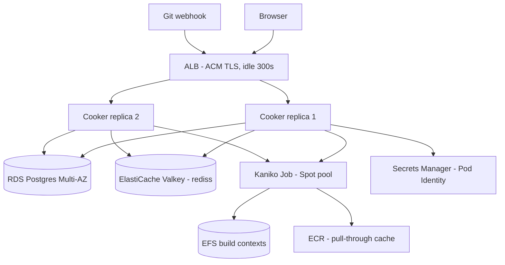

# Hosting Cooker on AWS + Vercel

> **Advisory, date-stamped 2026-06-11.** This guide recommends a hosting
> topology and sizes it. **Every price here is a rough estimate**, carries an
> inline source, and was **retrieved 2026-06-11**. AWS pricing changes and your
> usage will differ — **re-verify every figure at apply time**. The
> authoritative engineering state lives in [`../../backlog.md`](../../backlog.md);
> the IaC + overlays this guide drives live under
> [`../../deploy/aws/`](../../deploy/aws/) and [`../../deploy/vercel/`](../../deploy/vercel/).
>
> Items the synthesis could not resolve are marked **OPEN** and listed in §8.
> Where a number was missing it is written `OPEN` rather than invented.

---

## 1. Executive summary

**Topology in one line:** UAT runs the Cooker **SPA on Vercel** (split-origin,
per-PR previews) talking to a single **AWS Lightsail** backend behind Caddy;
**production runs on AWS EKS Auto Mode** in three sizing tiers (Starter / Team /
Scale).

**The three production headlines** (rough estimates, retrieved 2026-06-11;
us-east-1 baseline / ap-southeast-1 deploy recommendation):

| Tier | us-east-1 $/day | ap-southeast-1 $/day | /mo (us-east-1) |
|---|---|---|---|
| Starter | ~$9.61 | ~$11.00 | ~$292 |
| Team | ~$32.11 | ~$38.53 | ~$977 |
| Scale | ~$54.09 | ~$64.71 | ~$1,645 |

**UAT headline:** ~**$1.45/day** (~$44/mo) — Vercel Pro 1 seat + Lightsail 4 GB.
A no-Vercel budget alternative (Hetzner CX22, no per-PR previews) is ~$0.15/day.

**Region verdict:** deploy to **ap-southeast-1** (Singapore) — full EKS Auto
Mode + ElastiCache Serverless parity confirmed, at a +15–22% premium over
us-east-1 (the cheapest baseline column). **ap-southeast-7 (Bangkok) is NOT
launch-ready** as of 2026-06-11 (EKS Auto Mode + ElastiCache Serverless
availability unverified there; opt-in region; premium unknown) — re-evaluate in
~6 months.

> This is a **managed AWS track**. It is deliberately heavier and pricier than
> the VPS path in [`../product-plan.md`](../product-plan.md) §6, which remains
> the budget default (~$15–45/mo single-replica k3s). Choose this track when you
> want managed Postgres/cache, in-cluster Spot build capacity, and per-PR UAT
> previews — not to minimize cost.

---

## 2. UAT on Vercel

### 2.1 Architecture

The Cooker frontend is a Vite SPA. On Vercel it is hosted **alone** and points
at a Cooker **backend origin** running elsewhere. The frontend already supports
this: `VITE_API_BASE_URL` drives both `fetch` and the WebSocket authority via
[`../../frontend/src/api/origin.ts`](../../frontend/src/api/origin.ts) (landed
in commit `cc5343e`). When `VITE_API_BASE_URL` is unset the SPA falls back to
same-origin, byte-for-byte, so the single-binary deployment is unaffected.

```
Browser ──HTTPS──> Vercel (SPA static assets, per-PR preview URLs)
   │
   ├──HTTPS  fetch ─────────────> Caddy ─> Cooker backend (Lightsail :8080)
   └──WSS    live logs ─────────> Caddy ─> Cooker backend (Lightsail :8080)
                                   (Caddy passes the WS Upgrade through;
                                    Let's Encrypt TLS, auto-renew)
```

### 2.2 Why split-origin (the WebSocket verdict)

**Vercel rewrites cannot proxy WebSockets**, and Vercel Serverless Functions
don't support WebSocket connections (source: vercel.com/kb "Do Vercel
Serverless Functions support WebSocket connections?"; the HTTP proxy also caps
responses at 120s — vercel.com/docs limits, both retrieved 2026-06-11). Cooker's
live build-log stream is a long-lived WebSocket, so the SPA must reach the
backend **origin directly**. A "keep single origin, proxy through Vercel"
shape was **rejected** for exactly this reason — and it wouldn't give per-PR
previews either, which is the *only* reason to add Vercel here.

### 2.3 Preview-auth recipe (and why)

Vercel mints a **new unguessable hostname per preview deployment**. Real OIDC
cannot be used on previews:

- **Google forbids wildcard redirect URIs** — each must be registered exactly
  (source: developers.google.com/identity/protocols/oauth2/web-server, retrieved
  2026-06-11).
- **Keycloak ≥ 24.0.3** stopped letting a wildcard cross hostnames (source:
  keycloak.org/docs upgrading guide, retrieved 2026-06-11).

So:

- **Previews** run `VITE_OIDC_ENABLED=false` and use Cooker's **local
  email+password auth** against the shared UAT backend, which sets
  `COOKER_ALLOWED_ORIGINS=*` — **legal only in `COOKER_ENV=uat`** (a wildcard
  origin is rejected at boot under `production`).
- The **fixed UAT domain** (a stable hostname) runs `VITE_OIDC_ENABLED=true`
  with a single **exactly-registered** redirect URI.

### 2.4 Environment matrix

| Variable | Production (fixed domain) | Preview (per-PR) |
|---|---|---|
| `VITE_API_BASE_URL` | `https://uat-api.<domain>` | `https://uat-api.<domain>` |
| `VITE_OIDC_ENABLED` | `true` | `false` |
| `VITE_OIDC_AUTHORITY` | UAT IdP issuer | _(unset)_ |
| `VITE_OIDC_CLIENT_ID` | client id for the fixed domain | _(unset)_ |
| `VITE_OIDC_REDIRECT_URI` | `https://<fixed-domain>/auth/callback` | _(unset)_ |

Backend `.env.uat` on the Lightsail host: `COOKER_ENV=uat`,
`COOKER_ALLOWED_ORIGINS=*`, and the OIDC issuer/client/redirect for the fixed
domain (exact, no wildcard). **Webhooks target the backend origin**, never the
Vercel SPA origin. The backend also serves its own embedded copy of the UI at
the API origin — a kept ops fallback (a documented duplicate UI), not the
primary preview surface.

### 2.5 Cost (~$1.45/day)

UAT $/day (month = 730h; rough estimates, retrieved 2026-06-11):

| Line | $/day | Source |
|---|---|---|
| Vercel Pro, 1 seat | 0.66 | vercel.com/pricing |
| Lightsail 4 GB (2 vCPU / 4 GB / 80 GB SSD / 4 TB transfer, IPv4 incl.) | 0.79 | aws.amazon.com/lightsail/pricing/ |
| **UAT total** | **1.45** (~$44/mo) | |

Budget alternative (no Vercel, no previews):

| Line | $/day | Source |
|---|---|---|
| Vercel Hobby | 0.00 | vercel.com/pricing |
| Hetzner CX22 | 0.15 | hetzner.com/news/new-cx-plans/ |
| **Budget total** | **0.15** | |

EC2 comparison (why Lightsail wins on the bundle): t4g.medium 0.81 + IPv4 0.12 +
80 GB gp3 0.21† = 1.14 — but Lightsail bundles IPv4 **and** 4 TB transfer, which
the EC2 line doesn't. († = estimate.)

### 2.6 Setup runbook

Follow [`../../deploy/vercel/README.md`](../../deploy/vercel/README.md): Vercel
project settings (Root Directory `frontend`, Vite, Node 20.x, **Deployment
Protection Disabled** — use Shareable Links if you must gate previews), the env
matrix above, and the 10-step Lightsail + Caddy backend sketch (static IP →
DNS → firewall 80/443 → Docker → `.env.uat` → Caddy reverse-proxy with auto-TLS
→ point `VITE_API_BASE_URL` at it → smoke test the WS stream).

---

## 3. Production on AWS (EKS Auto Mode)

### 3.1 Why EKS Auto Mode

EKS **Auto Mode** manages the compute (Karpenter-based provisioning), the AWS
Load Balancer Controller, and the EBS CSI driver **off-cluster** — you don't run
those controllers yourself. Nodes are **Bottlerocket** with a **21-day max
lifetime** (expect rolling node recycles). The management **fee is ~12% of the
on-demand instance price, charged per instance — and it applies even on Spot**
(so the Spot discount is partly offset; see §4 traps). **EFS CSI is NOT built
in** — it's installed as an add-on (the build-context volume needs it). Source:
aws.amazon.com/eks/pricing/, retrieved 2026-06-11.

All tiers use **Graviton** (`m7g`/`t4g`/`r7g`) because the Cooker image is
multi-arch — ~19% price/performance for free.

### 3.2 Team-tier topology



> The diagram uses valid Mermaid (plain `-->` edges, short ASCII node labels, no
> HTML entities) so it renders in the docs site.

### 3.3 Traffic flows

- **UI / API:** Browser → ALB (ACM TLS termination, `idle_timeout=300`) → a
  Cooker replica (target-type `ip`).
- **WebSocket (live logs):** Browser → ALB → replica. The ticket flow is:
  `POST /api/v1/ws-tickets` returns a single-use 60s ticket; the browser then
  opens `wss://<host>/...?ticket=<value>`. **Team+ needs Redis** so a ticket
  issued by replica A is honored at the WS upgrade on replica B (the ticket
  store is shared via ElastiCache). The ALB idle timeout (300s) must exceed
  Cooker's ~54s WS ping or the ALB will clip the connection.
- **Build path:** a Cooker replica creates a **Kaniko Job**; the Job reads the
  build context from the shared **EFS** PVC, builds, and **pushes to ECR**
  (Kaniko's built-in `amazon-ecr-credential-helper` + Pod Identity on the
  `cooker-kaniko` SA — zero in-pod config). Base images pull through the **ECR
  pull-through cache** (Docker Hub rate-limit fix).
- **Webhook:** Git provider → ALB → backend `/api/.../webhook`. Webhooks target
  the ALB host, not Vercel.
- **Secrets:** replicas read Secrets Manager via the `cooker` SA's **Pod
  Identity** role (scoped to exactly the escrow key + db password + oidc client
  secret ARNs).

### 3.4 Why-this-service (rationale for every major pick)

- **EKS Auto Mode** (not self-managed node groups): offloads Karpenter, the ALB
  controller, and EBS CSI. Trade-off: the ~12% per-instance fee (even on Spot).
- **Graviton m7g/t4g/r7g**: ~19% price/perf; the image is multi-arch so arm64
  is safe.
- **EFS for build contexts** (Standard, Elastic throughput, lifecycle → IA 14d):
  Kaniko Jobs and the Cooker pod need a **ReadWriteMany** share for the context.
  A nightly GC CronJob (`find -mtime +3 -delete`) trims it — **nothing in the
  repo GCs contexts**, so the operator must run it. An EBS-RWO same-node
  alternative is documented for Starter-budget only, but it's **blocked on a
  builder nodeSelector/tolerations repo follow-up** (the build Job and the
  Cooker pod must co-locate on the node holding the EBS volume).
- **ALB ingress** (via Auto Mode's controller): `className alb`, `target-type
  ip`, ACM cert, and **`idle_timeout.timeout_seconds=300` MANDATORY** (WS ping
  ~54s vs ALB default 60s). The chart's NetworkPolicy `ingressNamespaceLabel`
  can't match ALB ENIs (they aren't pods), so **`networkPolicy.enabled=false`**
  + a documented **CIDR-based** NetworkPolicy alternative manifest.
- **Pod Identity** (not IRSA): maps the SA name → IAM role server-side, so
  `serviceAccount.annotations` stays `{}`. Simpler than IRSA's OIDC-provider +
  annotation dance.
- **ECR creds:** Kaniko Jobs use the built-in credential helper + Pod Identity
  (zero config). The **crane in-process pusher** instead reads
  `$DOCKER_CONFIG/config.json` per push (`authn.DefaultKeychain`, verified at
  [`../../backend/internal/build/pusher/crane.go`](../../backend/internal/build/pusher/crane.go):29-33),
  so a **CronJob refreshes a `dockerconfigjson` Secret every 6h** (ECR tokens
  live ~12h) mounted via `DOCKER_CONFIG=/etc/cooker-docker`. **Repo follow-up:**
  wiring the `ecr-login` keychain into crane deletes that CronJob.
- **ECR pull-through cache for Docker Hub**: the Docker Hub rate-limit fix.
  **Recommended and always on.** (The VPC interface endpoints that would keep
  ECR traffic off NAT are a different thing — see the cost bounce in §4: they
  cost ~6× the NAT data they save, so they're **optional hardening**, not a
  saving.)
- **RDS Postgres `sslmode=require`**: works with the default RDS cert (no CA
  bundle — `lib/pq` `require` = TLS without verification). `verify-full` + a
  mounted CA bundle is documented as hardening. Starter `db.t4g.micro` single-AZ
  20 GB; Team `db.m7g.large` Multi-AZ 100 GB (storage bills ×2); Scale
  `db.r7g.large` Multi-AZ. **RDS over Aurora Serverless v2 at Scale**: ASv2's
  2-ACU floor billed 24/7 (~$7.09/day for 4 GB no-standby) loses to a steady
  r7g for non-spiky load — Aurora is the right call only for spiky/idle.
- **Redis:** **none at Starter** (in-memory WS hub/ticket/rate-limit backends
  are legal at `replicaCount=1`); **Team+ ElastiCache Serverless Valkey** via
  `rediss://` (TLS-only; `go-redis` `ParseURL` handles `rediss` — verified).
- **IdP: Cognito Essentials** (10k MAU free) + a **pre-token-generation V2_0
  Lambda** injecting the `groups` claim into the access token (claim name
  hardcoded `groups` at
  [`../../backend/internal/auth/oidc.go`](../../backend/internal/auth/oidc.go):286;
  the chart `oidc.scopes` is set **without** `groups` because Cognito has no
  groups scope — scopes are hardcoded incl. groups at
  [`../../backend/internal/config/config.go`](../../backend/internal/config/config.go):287,
  hence the overlay overrides them). **GATED on a half-day spike (OPEN-7)**: the
  verifier enforces `aud == ClientID`
  ([oidc.go](../../backend/internal/auth/oidc.go):121) but **Cognito access
  tokens carry `client_id`, not `aud`** — the spike decides Lambda-fix vs a
  small configurable-audience code change. Alternatives: **Google OAuth** (no
  groups → viewer-only) and **in-cluster Keycloak** (ops burden), both
  documented.
- **Builders on Spot at Team+** (`m7g.xlarge`/`2xlarge`): ~70% cheaper. Kaniko
  is **not checkpointable** → a Spot interruption is a failed run (the jobqueue
  retries). `capacity-optimized` + OD fallback. The Auto Mode fee stays
  OD-rate on Spot (~30% effective overhead). **Clean Spot targeting is blocked
  on the builder nodeSelector/tolerations repo follow-up** — until then the
  Spot NodePool is left **untainted and Spot-preferring**.
- **Observability:** Starter = **CloudWatch Container Insights + Logs (7-day
  retention) + a Fluent Bit filter that drops Kaniko layer logs** (CW
  **ingestion** at $0.50/GB is the trap, not retention). Team+ = AMP + Managed
  Grafana (~a wash on metrics at ~$2.59/day for 5k series/15s) — wins only if it
  also cuts log ingestion.
- **DR:** RDS automated snapshots; `COOKER_SECRET_KEY` escrowed in Secrets
  Manager (**losing it bricks encrypted secret backups**); **EFS not backed up**
  (contexts are ephemeral — explicitly declined).
- **IaC: Terraform everything, no eksctl** (single state); Helm deployed from
  CI/operator, **not** `helm_release`.

### 3.5 Rejected alternatives

| Option | Why rejected |
|---|---|
| **CloudFront + S3** for the SPA | No per-PR preview-per-branch without building that pipeline yourself — the sole reason to use Vercel. |
| **Keep single origin** (proxy WS through Vercel) | Vercel can't proxy WebSockets; also gives no previews. |
| **ECS + buildkitd** | Loses the in-cluster Kaniko Job model + the Helm chart's builder wiring; more glue, no upside here. |
| **App Runner** | No persistent build volume / Job model; can't run the Kaniko build pattern. |
| **Lightsail k3s** for production | Fine for UAT backend; for production you lose managed RDS/cache, Auto Mode compute, and ALB. (Production already has a VPS path — see product-plan §6.) |
| **eksctl** | Splits cluster lifecycle out of Terraform state; we keep one state. |
| **IRSA** (instead of Pod Identity) | Requires the OIDC-provider + per-SA annotation dance; Pod Identity is simpler and keeps `serviceAccount.annotations` empty. |
| **Aurora Serverless v2 at Scale** | The 2-ACU 24/7 floor loses to a steady r7g for non-spiky load (~$7.09 vs the RDS line). Aurora only for spiky/idle. |
| **nginx-ingress** | Auto Mode already manages the ALB controller; running nginx-ingress duplicates it and forfeits ALB/ACM integration. |
| **ap-southeast-7 (Bangkok)** | Not launch-ready: EKS Auto Mode + ElastiCache Serverless availability unverified; opt-in region; premium unknown. Re-evaluate in ~6 months. |

---

## 4. Cost

> **All figures are rough estimates, retrieved 2026-06-11**, month = 730h.
> `†` marks a line that is itself an estimate (derived rate, usage assumption,
> or ap-southeast-1 figure extrapolated from us-east-1). Re-verify at apply
> time. Source key in §9. Columns: **us-east-1 / ap-southeast-1**.

### 4.1 Starter — ~$9.61/day (~$292/mo) us-east-1 / ~$11.00/day ap-southeast-1

| Line | us-east-1 | ap-southeast-1 |
|---|---|---|
| EKS control plane | 2.40 | 2.40 |
| m7g.large OD | 1.96 | 2.45 |
| Auto Mode fee | 0.24† | 0.29† |
| EFS 10 GB | 0.10 | 0.12† |
| EFS elastic 2 GB/day | 0.09 | 0.11† |
| RDS t4g.micro | 0.38 | 0.48† |
| RDS 20 GB | 0.08 | 0.09† |
| ALB + 1 LCU | 0.73 | 0.80† |
| 1×NAT + 5 GB/day | 1.31 | 1.72† |
| ECR 5 GB | 0.02 | 0.02 |
| Cognito ≤ 10k MAU | 0.00 | 0.00 |
| Secrets ×5 | 0.07 | 0.07 |
| CW logs 2 GB/day | 1.01 | 1.15† |
| Container Insights | 0.84† | 0.92† |
| Route 53 | 0.02 | 0.02 |
| IPv4 ×3 | 0.36 | 0.36 |
| **TOTAL** | **9.61 (~$292/mo)** | **11.00 (~$335/mo)** |

### 4.2 Team — ~$32.11/day (~$977/mo) us-east-1 / ~$38.53/day ap-southeast-1

| Line | us-east-1 | ap-southeast-1 |
|---|---|---|
| EKS control plane | 2.40 | 2.40 |
| 3×m7g.large | 5.88 | 7.34 |
| Auto Mode fee | 0.71† | 0.88† |
| Spot build m7g.xlarge 4h/day | 0.34† | 0.47† |
| EFS | 0.19 | 0.23† |
| RDS m7g.large Multi-AZ | 8.06 | 10.08† |
| RDS 100 GB ×2 | 0.76 | 0.91† |
| ElastiCache Serverless (1 GB + 10M ECPU/day) | 2.04 | 2.45† |
| 3×NAT | 3.47 | 4.55† |
| 2 ECR endpoints ×3 AZ (OPTIONAL — see bounce) | 1.46† | 1.75† |
| ALB + 2 LCU | 0.92 | 0.99† |
| CW 5 GB/day | 2.53 | 2.88† |
| CI 3 nodes | 2.52† | 2.77† |
| AMP alt | (2.59)† | (2.59)† |
| WAF opt | (0.83)† | (0.83)† |
| IPv4 ×6 | 0.72 | 0.72 |
| misc | 0.11 | 0.11 |
| **TOTAL** | **32.11 (~$977/mo)** | **38.53 (~$1,172/mo)** |

> The "2 ECR endpoints" line is **optional** (see the bounce note below); the
> AMP and WAF lines are alternatives/options shown in parentheses and are **not**
> in the total.

### 4.3 Scale — ~$54.09/day (~$1,645/mo) us-east-1 / ~$64.71/day ap-southeast-1

| Line | us-east-1 | ap-southeast-1 |
|---|---|---|
| EKS control plane | 2.40 | 2.40 |
| 6×m7g.large | 11.75 | 14.69 |
| Auto Mode fee | 1.41† | 1.76† |
| Spot 2xlarge 8h/day | 1.35† | 1.88 |
| RDS r7g.large Multi-AZ + 200 GB ×2 | 12.98 | 16.16† |
| ElastiCache (2 GB + 50M ECPU) | 4.15† | 4.98† |
| EFS 25 GB | 0.48 | 0.57† |
| 3×NAT + 10 GB | 3.69 | 4.84† |
| endpoints | 1.49 | 1.78† |
| ALB + 4 LCU | 1.31 | 1.37† |
| CW 10 GB | 5.07 | 5.77† |
| CI ×6 | 5.04† | 5.54† |
| WAF | 2.03† | 2.03† |
| IPv4 | 0.72 | 0.72 |
| misc | 0.22 | 0.22 |
| **TOTAL** | **54.09 (~$1,645/mo)** | **64.71 (~$1,968/mo)** |

> Aurora Serverless v2 alternative at this tier: ~$7.09–12.85/day documented —
> **but only wins for spiky/idle load**; for steady load the r7g line above is
> cheaper (see §3.4).

### 4.4 Traps ledger

| Trap | Mechanism | Worked example |
|---|---|---|
| **NAT data** | $0.045/GB | 1 GB image × 50 pulls/day = $2.25/day |
| **EFS writes** | $0.06/GB | 50 GB/day CI = $3/day |
| **CW ingestion** | $0.50/GB (NOT retention) | debug 20 GB/day = $10/day |
| **inter-AZ** | $0.01/GB each way | adds up across replicas ↔ Multi-AZ DB |
| **LCU** | ALB capacity unit | ~3k concurrent WS ≈ 1 LCU |
| **IPv4** | $0.005/hr | ≈ $22/mo at Team (6 addresses) |
| **EKS extended support** | 6× control-plane | +$12/day past ~14mo on an EOL version |
| **Auto Mode fee on Spot** | fee stays OD-rate | ~30% effective overhead on the Spot price |
| **VPC endpoints per-AZ** | billed per endpoint-AZ-hr | ×3 multiplier at 3 AZ (see bounce) |
| **RDS Multi-AZ storage** | storage doubles too | not just compute — the GB line ×2 |

### 4.5 The per-AZ ECR-endpoint bounce (resolution)

VPC **interface** endpoints bill **$0.01/endpoint-AZ-hr** (source:
aws.amazon.com/vpc/pricing/, retrieved 2026-06-11). Two ECR endpoints (`api` +
`dkr`) × 3 AZ = **$1.44/day** — roughly **6× the NAT data they'd avoid** at
5 GB/day. **Resolution:** book the ECR interface endpoints as **OPTIONAL
security / rate-limit hardening** (or scope them to a single AZ), **NOT a cost
saving**. They default **off** in the Terraform
([`enable_ecr_interface_endpoints = false`](../../deploy/aws/terraform/variables.tf)).
The **ECR pull-through cache itself stays recommended** (it's the Docker Hub
rate-limit fix, and the S3 gateway endpoint — which *is* free — keeps the layer
blobs off NAT).

### 4.6 Savings levers

| Lever | Effect | Caveat |
|---|---|---|
| Graviton | ~−19% (already taken) | image is multi-arch, so free |
| Spot build pool | −$0.39/day at Team | Kaniko not checkpointable; Auto Mode fee stays OD-rate |
| Single NAT | −$2.16/day | loses egress if that AZ dies (Starter only) |
| 1yr Compute Savings Plan | ~−20–28% on the node line (typical, unquoted) | Auto-Mode-fee coverage **unverified** |
| Pull-through cache | ~−$0.35/day per 10 GB/day off NAT | — |
| Drop debug logs | −$0.50/GB-day | Fluent Bit filter drops Kaniko layer logs |

---

## 5. Provisioning runbook

> Detailed file map + bootstrap order is in
> [`../../deploy/aws/README.md`](../../deploy/aws/README.md). This is the
> end-to-end sequence.

**Step 0 — Domain + Route 53 + state bucket.** Have a domain with a Route 53
hosted zone (for ACM DNS validation + the ALB alias). Create the S3 state bucket
(versioned), then copy
[`backend.tf.example`](../../deploy/aws/terraform/backend.tf.example) →
`backend.tf` and fill in the bucket (TF ≥ 1.10 native locking — no DynamoDB).

**Step 1 — `terraform apply`.** `terraform init` then
`terraform apply -var-file=envs/prod-<tier>.tfvars`. This stands up VPC, EKS Auto
Mode, RDS, ElastiCache (Team+), ECR + pull-through cache, Cognito-adjacent
secrets, Pod Identity associations, and Budgets. Order within the state is
handled by module dependencies (network → cluster → data/registry/observability).

**Step 2 — Cognito pool + pre-token Lambda + THE AUD SPIKE.**
> ⚠️ **OPEN-7 — half-day spike, gates the IdP choice.** Cooker's verifier
> enforces `aud == ClientID` ([oidc.go](../../backend/internal/auth/oidc.go):121),
> but **Cognito access tokens carry `client_id`, not `aud`**. Before committing
> to Cognito, run a half-day spike to decide: fix it in the **pre-token-generation
> V2_0 Lambda** (which also injects the `groups` claim Cooker reads — claim name
> hardcoded `groups`, [oidc.go](../../backend/internal/auth/oidc.go):286), **or**
> make a **small configurable-audience code change**. Set the chart `oidc.scopes`
> **without** `groups` (Cognito has no groups scope). Fallbacks: **Google OAuth**
> (no groups → viewer-only) or **in-cluster Keycloak** (ops burden).

**Step 3 — Helm install with the overlay.**
`helm upgrade --install cooker deploy/helm/cooker -f
deploy/aws/values/values-aws-<tier>.yaml` plus the per-cluster `--set`
placeholders the overlay leaves empty (`database.host`, the ACM
`certificate-arn`, `oidc.issuerUrl/clientId/redirectUrl`, `oidc.allowedOrigins`,
`secretKey.existingSecret`). **Known chart gaps** (also in §8): the prod+OIDC
`ingress.tls` guard doesn't account for ALB-terminated TLS, so pass a dummy
`ingress.tls` entry; and the dockerconfig Secret can't be volume-mounted via the
chart (no `extraVolumes`).

**Step 4 — Smoke tests.** Reuse the launch-readiness §4 list (see
[`../audits/launch-readiness.md`](../audits/launch-readiness.md) and the 7
checks in [`ROLLOUT.md`](ROLLOUT.md) Phase 1): boot survives a missing IdP;
pipelines execute end-to-end; heartbeat advances; orphan sweep on hard restart;
graceful drain; `/health/ready` flips on dependency loss; **multi-replica WS
broadcast crosses replicas** (Team+).

**Step 5 — First-build validation.** Trigger a build and confirm: the **Kaniko
Job** is created, reads its context from the **EFS** PVC, builds, and **pushes
to ECR** (Pod Identity + the credential helper, zero in-pod config). Confirm the
base image pulled through the **ECR pull-through cache**, not Docker Hub direct.

**Step 6 — DNS cutover.** Point the app hostname at the ALB the chart's Ingress
provisioned. Validate `https://<domain>/health/ready` from outside, watch for
5 min (per [`ROLLOUT.md`](ROLLOUT.md) Phase 4), then flip DNS.

---

## 6. Scaling path: Starter → Team → Scale

What actually changes between tiers, and whether it's a **values flip** (Helm
overlay swap, no infra change) or a **terraform change** (re-apply with a
different tfvars):

| Change | Starter → Team | Mechanism |
|---|---|---|
| Replicas 1 → 2 | overlay (`replicaCount`, `pdb.enabled`) | values flip |
| Memory → Redis backends | overlay (`wsHub/wsTicket/rateLimit.backend`, `redis.url`) | values flip — **but** requires the ElastiCache cluster to exist first (terraform) |
| ElastiCache Serverless Valkey | `elasticache_enabled_by_tier["team"]=true` | terraform apply |
| RDS single-AZ → Multi-AZ + bigger class | `db_*_by_tier["team"]` | terraform apply (Multi-AZ conversion is online but slow) |
| 1 NAT → 3 NAT | `nat_gateway_count_by_tier["team"]=3` | terraform apply |
| Spot build pool | apply `spot-nodepool.example.yaml` | kubectl/GitOps (out of band) |

| Change | Team → Scale | Mechanism |
|---|---|---|
| Replicas 2 → 3 + HPA 3..6 | overlay (`replicaCount`, `hpa.enabled`) | values flip |
| RDS m7g.large → r7g.large + 200 GB | `db_*_by_tier["scale"]` | terraform apply |
| Bigger Spot pool (2xlarge) | `spot_build_instance_types` + NodePool | terraform + kubectl |
| WAF | ALB `wafv2-acl-arn` annotation (overlay) + WAF ACL (terraform) | both |

> **Sequencing rule:** provision the dependency (terraform) **before** flipping
> the values that consume it. Flipping `wsHub.backend=redis` before the
> ElastiCache endpoint exists will fail `Config.Validate` at boot.

A consolidation option once production exists: run **UAT on the prod EKS
cluster** as a second Helm release in a `cooker-uat` namespace, sharing the ALB
(an extra host rule) and a single RDS instance (separate database). Fixed cost
≈ $0 on top of prod. This is the path to retire the standalone Lightsail UAT
backend later.

---

## 7. DR & ops

- **RDS snapshots + restore rehearsal.** Automated snapshots are on
  (`backup_retention_period`). **Rehearse a restore** to a throwaway instance at
  least once so the RPO/RTO is real, not theoretical. Multi-AZ is failover, not
  backup — you still need snapshots for "someone dropped a table".
- **`COOKER_SECRET_KEY` escrow.** It lives in Secrets Manager
  (`<prefix>/cooker-secret-key`). **Losing it bricks encrypted secret backups**
  under the database secrets backend — there is no recovery. Treat it as the
  crown jewel; its ARN is the first thing in the `cooker` SA's Pod Identity
  read scope.
- **EFS is NOT backed up.** Build contexts are ephemeral and explicitly declined
  from backup. The **nightly GC CronJob** (`find -mtime +3 -delete`) keeps EFS
  from growing without bound — **nothing in the repo GCs contexts**, so you must
  run it (example in
  [`modules/registry`](../../deploy/aws/terraform/modules/registry/) / the GC
  pattern is documented; wire it as a CronJob in the `cooker` namespace).
- **EKS upgrade cadence.** Auto Mode recycles nodes on a **21-day max lifetime**
  (Bottlerocket) — expect rolling node replacement as normal, not an incident.
  Watch the **EKS standard-support window**: extended support bills **~6×** the
  control-plane rate past it (~+$12/day). **Plan a control-plane upgrade before
  month ~14** on any given version (calendar it).

---

## 8. Open questions

These are unresolved as of 2026-06-11. Items the synthesis could not close are
`OPEN`; repo follow-ups are code changes that would simplify the design.

**OPEN (verify before relying on a number / before commit):**

- **Auto Mode `m7g.large` exact fee cell** — the ~12% figure is applied; the
  exact per-instance fee line is `OPEN` (marked † in the tables).
- **ECPU unit ambiguity** — ElastiCache Serverless ECPU is priced $0.0023/M
  **assuming per-1M**. If it's per-1k, the **Team ECPU line jumps from ~$0.02 to
  ~$23/day**. **Verify before committing to ElastiCache Serverless.** A
  node-based `cache.t4g.micro` (~$0.31–0.38/day) is the steady-small-cache
  alternative.
- **`cache.t4g.micro` rate** — quoted as a range (~$0.31–0.38/day); confirm.
- **ap-southeast-1 derived rates (†)** — extrapolated from us-east-1 at
  +15–22%; confirm per-line at apply time.
- **Spot volatility** — `m7g.xlarge/2xlarge` Spot price + interruption rate not
  pinned; affects the build-pool lines.
- **Bangkok (ap-southeast-7) feature matrix** — EKS Auto Mode + ElastiCache
  Serverless availability unverified; re-evaluate in ~6 months.
- **Cognito aud spike (OPEN-7)** — `aud` vs `client_id` on Cognito access
  tokens; gates the IdP choice (see §5 step 2).
- **`terraform-aws-modules/eks` version** — `cluster_compute_config` (Auto Mode)
  is believed available ≥ v20.31; confirm the exact arg shape against the module
  changelog.
- **CloudWatch observed log/metric volumes** — the CW lines assume 2/5/10 GB/day
  by tier; your real volume drives the (trap-prone) ingestion cost.
- **aws provider major** — pinned `~> 6.0` (OPEN-version); confirm the current
  major doesn't rename Auto Mode / ElastiCache Serverless args.

**Repo follow-ups (code changes that delete glue):**

- **crane `ecr-login` keychain** — wiring the
  `amazon-ecr-credential-helper` keychain into the crane pusher
  ([crane.go](../../backend/internal/build/pusher/crane.go)) would **delete the
  dockerconfig-refresh CronJob** entirely (the pusher would mint ECR tokens via
  Pod Identity itself).
- **builder nodeSelector/tolerations** — the builder doesn't stamp
  nodeSelector/tolerations onto Kaniko Jobs, so clean Spot targeting (and the
  EBS-RWO same-node context alternative) is blocked. Until then the Spot
  NodePool is untainted/Spot-preferring.
- **Cognito audience config** — a small `configurable-audience` change in the
  verifier would resolve OPEN-7 without a Lambda.
- **Chart `extraVolumes`/`extraVolumeMounts`** — **confirmed missing** from the
  Cooker Helm chart (it exposes `extraEnv`/`extraEnvFrom` only). Without it the
  refreshed **dockerconfig Secret cannot be mounted** at `/etc/cooker-docker`
  via Helm; `DOCKER_CONFIG` is settable via `extraEnv` but the **volume mount is
  the gap**. Workaround today: a kustomize/pod-spec patch over the Helm output.
  Adding `extraVolumes`/`extraVolumeMounts` to the chart is the clean fix.
- **Chart `ingress.tls` guard vs ALB-terminated TLS** — the prod+OIDC fail-guard
  ([templates/ingress.yaml](../../deploy/helm/cooker/templates/ingress.yaml):15)
  demands `ingress.tls` even when TLS is terminated at the ALB via ACM. CI and
  operators pass a dummy `ingress.tls` entry to template; a guard that accepts
  an ALB cert annotation would remove the workaround.

---

## 9. Appendix: source key

Every price above carries one of these inline sources; all **retrieved
2026-06-11**.

| Source | Used for |
|---|---|
| aws.amazon.com/eks/pricing/ | EKS control plane, Auto Mode fee |
| aws.amazon.com/efs/pricing/ | EFS storage + throughput + IA |
| aws.amazon.com/elasticloadbalancing/pricing/ | ALB + LCU |
| aws.amazon.com/elasticache/pricing/ | ElastiCache Serverless (storage + ECPU) |
| aws.amazon.com/rds/postgresql/pricing/ | RDS instance + storage |
| aws.amazon.com/rds/aurora/pricing/ | Aurora Serverless v2 alternative |
| aws.amazon.com/vpc/pricing/ | NAT, interface endpoints, inter-AZ |
| aws.amazon.com/cognito/pricing/ | Cognito MAU |
| aws.amazon.com/cloudwatch/pricing/ | CW logs ingestion + Container Insights |
| aws.amazon.com/prometheus/pricing/ | AMP (metrics) alternative |
| aws.amazon.com/ecr/pricing/ | ECR storage + pull-through |
| aws.amazon.com/secrets-manager/pricing/ | Secrets Manager |
| aws.amazon.com/route53/pricing/ | Route 53 hosted zone + queries |
| aws.amazon.com/waf/pricing/ | WAFv2 (Scale) |
| aws.amazon.com/lightsail/pricing/ | Lightsail 4 GB (UAT backend) |
| vercel.com/pricing | Vercel Pro / Hobby |
| vercel.com/kb, vercel.com/docs (limits) | WebSocket + 120s proxy cap |
| hetzner.com/news/new-cx-plans/ | Hetzner CX22 (budget UAT) |
| instances.vantage.sh | Spot + instance price cells |
| developers.google.com/identity/protocols/oauth2/web-server | Google no-wildcard redirect |
| keycloak.org/docs (upgrading) | Keycloak ≥ 24.0.3 wildcard change |

---

> _Synthesis advisory, 2026-06-11. Prices are estimates with sources; re-verify
> at apply time. Engineering state of record: [`../../backlog.md`](../../backlog.md)._
