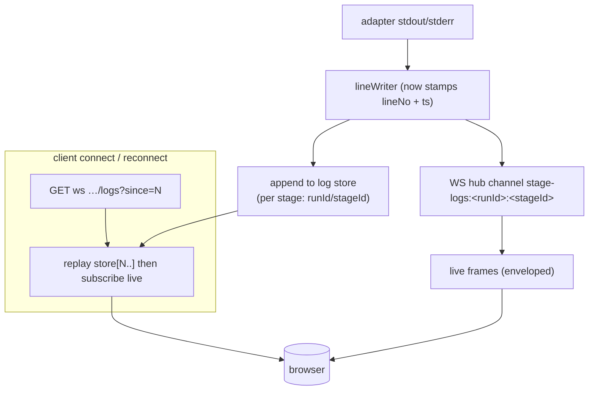
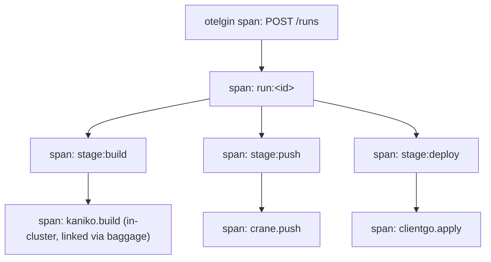

# Cooker execution observability redesign — log history/replay + execution tracing

> Status: **proposal, not approved.** Written 2026-05-30.
> Scope: the two execution-observability gaps **not** covered by
> [`dag-adaptation-2026.md`](dag-adaptation-2026.md): (1) run/stage **log history & replay**, and
> (2) **distributed tracing of the execution path**. The DAG primitives (conditional edges, outputs,
> retry depth, caching, post-hooks) are already designed in `dag-adaptation-2026.md` — this doc does
> **not** restate them.
> Baseline: the verified current state is in
> [`system-design/13-execution-pipeline.md`](../system-design/13-execution-pipeline.md).
> No code changes here — this is a design + phased plan.

---

## 1. Why this doc exists

`dag-adaptation-2026.md` is a thorough plan for the DAG *engine*. It tidies logging only as far as **T2
(wire `LogWriter` for push/deploy)** — which has landed — and it treats OTel propagation as "free" with
a single follow-up for skipped-stage span attributes. That leaves two things genuinely unaddressed, and
both are real (one is a defect, not a gap):

1. **Logs are not replayable.** A WebSocket subscriber that connects mid-run sees only *future* lines;
   after a stage ends the live stream is gone and the only history is `StageRun.Logs` via REST. There's
   no ring buffer, no "resume from line N", no drop signalling, and in multi-replica a client only sees
   stages on *its* replica. This breaks the basic expectation "I can scroll back through what happened."
2. **The execution path is invisible to tracing.** HTTP requests get an `otelgin` auto-span, but the
   runner only *propagates* span context — it never *starts* spans. A trace shows `POST /runs` took 5
   minutes with no child spans for build/push/deploy, and in-cluster Kaniko/Buildah Jobs can't link
   back to the run's trace.

Both are scoped here as additive workstreams that respect the existing extension points (the WS hub,
the `LogBroadcaster`, the observability package) and add **no** new hard runtime dependency for the
default single-binary deployment.

---

## 2. Part A — Log history & replay

### 2.1 Goals

- A subscriber that connects **mid-run** receives the backlog-so-far, then live updates, seamlessly.
- A subscriber that **reconnects** can resume from the last line it saw (`since=<lineNo>`).
- Logs survive **stage completion** and are queryable per stage without loading the whole run row.
- **Cross-replica:** any replica can serve any run's log history.
- A dropped slow client gets an explicit **`stream-truncated`** signal, not silence.
- **No new mandatory dependency** in the default (single-binary) deployment; Redis/object-store paths
  are opt-in for multi-replica, exactly like the existing WS hub backend split.

### 2.2 Design



**Log envelope.** Replace raw frames with a minimal JSON line envelope so replay is unambiguous and
ordered:

```json
{ "runId": "…", "stageId": "…", "seq": 1421, "ts": "2026-05-30T15:34:18.221Z", "line": "Step 3/7 …" }
```

`seq` is a monotonic per-stage counter (the source of `since=`). This is intentionally *not* the
`CKR-LOG/1` binary protocol (still a proposal in `protocols.md`); it's a small JSON envelope that the
current hub can carry today and that a future CKR-LOG/1 can subsume.

**Log store interface** (new, mirrors the existing strategy/backend split):

```go
// backend/internal/logstore/logstore.go
type Store interface {
    Append(ctx context.Context, runID, stageID string, e Entry) error
    // Read returns entries with seq >= since (since=0 → from start).
    Read(ctx context.Context, runID, stageID string, since int) ([]Entry, error)
}
```

Backends (selected by `COOKER_LOGSTORE_BACKEND`, default `memory`):

| Backend | Mechanism | Use |
|---|---|---|
| `memory` (default) | Per-stage bounded ring buffer (size cap, e.g. 4 MiB) + final flush to `StageRun.Logs` | Single binary / dev |
| `postgres` | Append rows to a `stage_logs` table `(run_id, stage_id, seq, ts, line)`; index on `(run_id, stage_id, seq)`; retention CronJob | Durable / multi-replica |
| `redis` | `XADD` to a Redis Stream `stagelogs:<runId>:<stageId>`; `XRANGE` for replay; capped via `MAXLEN` | Multi-replica, low-latency |

**Connect/replay protocol.** On WS subscribe, the hub reads `?since=N` (default 0), calls
`logstore.Read(runID, stageID, N)`, streams the backlog as enveloped frames, then attaches the client
to the live channel. A single hub-side sequence guard prevents a gap between "end of replay" and "first
live frame" (replay up to `seq=k`, then drop live frames with `seq<=k`).

**Drop signalling.** When the hub drops a slow client it sends one final control frame
`{"control":"stream-truncated","seq":<lastDelivered>}` before closing, so the UI can show "logs
truncated — click to reload from N" instead of silently missing lines.

### 2.3 Impact

- **Model/store:** new `internal/logstore/` package + (postgres backend) one additive migration
  `0NN_stage_logs.up.sql`. `StageRun.Logs` stays as the final-state convenience field.
- **Service:** `LogBroadcaster`/`lineWriter` (`backend/internal/service/logbroadcast.go`) stamp
  `seq`+`ts` and call `logstore.Append` alongside the existing hub broadcast. No change to adapters.
- **Server:** WS hub gains the replay step and the `stream-truncated` control frame
  (`backend/internal/server/websocket.go`, `wshub_logs.go`).
- **Frontend:** `useStageLogs` / `useWebSocket` track the last `seq`, pass `since=` on reconnect, and
  render the truncation control frame. `RunPage` can now show full history after refresh.
- **Tests:** mid-run join replays backlog; reconnect with `since=N` returns only newer lines; slow
  client receives `stream-truncated`; postgres/redis backends pass the same contract suite.

### 2.4 Decisions owed (Part A)

- **LA-1 — default backend.** Proposal: `memory` ring buffer (no new dependency) with `postgres`
  recommended for any real deployment. Alternative: make `postgres` the default when `DATABASE_URL` is
  set.
- **LA-2 — retention.** Proposal: per-stage cap + a retention window (e.g. 30 days) via the existing
  Helm retention CronJob. Owner decides the window.

---

## 3. Part B — Execution tracing

### 3.1 Goals

- A single trace for a run shows **child spans** per stage and per adapter operation, with durations.
- In-cluster builders (**Kaniko/Buildah**) emit spans that link back to the run trace.
- Configurable **sampling** so a busy system doesn't overwhelm the collector.
- Close the `/metrics` **auth** gap.

### 3.2 Design



**Explicit spans in the executor.** In the `taskFunc` wrapper (`backend/internal/service/executor.go`),
start a span per stage:

```go
ctx, span := tracer.Start(ctx, "stage:"+stage.Type.String(),
    trace.WithAttributes(attribute.String("stage.id", stage.ID),
                         attribute.String("run.id", runID)))
defer span.End()
// retry.Do(ctx, …) — each adapter receives the span-bearing ctx
```

Set `span.RecordError` + status on failure, and add `stage.skipped=true` once Primitive #2 lands (the
follow-up already noted in `dag-adaptation-2026.md` §11.2). One `run:<id>` parent span wraps the whole
executor invocation.

**Per-adapter spans.** Each builder/pusher/deployer starts a span around its real work
(`kaniko.build`, `crane.push`, `clientgo.apply`). These already receive a span-bearing `ctx` through
the runner's existing `MapCarrier` propagation — they just need to *start* spans.

**Propagation into in-cluster Jobs.** Add an observability helper
`observability.CarrierEnv(ctx) []corev1.EnvVar` that serializes the W3C `traceparent`/`tracestate` into
env vars; the Kaniko/Buildah Job spec injects them so the build container (if instrumented) continues
the trace. Even without an instrumented build image, the run trace gains a `build.job=<name>` span
attribute for correlation.

**Sampling + metrics auth.**

- `COOKER_OTEL_SAMPLER` = `always_on` | `always_off` | `parentbased_traceidratio` (+
  `COOKER_OTEL_SAMPLER_RATIO`, default e.g. 0.1).
- Gate `/metrics` behind either the existing OIDC/bearer auth or a dedicated scrape token
  (`COOKER_METRICS_TOKEN`); document for Prometheus `bearer_token_file`.

### 3.3 Impact

- **Observability pkg:** add the `tracer` accessor + `CarrierEnv` helper + sampler config
  (`backend/internal/observability/`).
- **Service/adapters:** span start/end in `executor.go` taskFunc and in each
  builder/pusher/deployer adapter (small, mechanical, additive).
- **Server:** `/metrics` auth wrapper.
- **New metrics:** `cooker_pipeline_stage_retries_total{type}` and
  `cooker_pipeline_stage_timeouts_total{type}` (the audit's observability gap), incremented in the
  retry/timeout paths. Keep labels low-cardinality (type/status only — **never** stage id or user id).
- **Tests:** an in-memory span exporter asserts the run→stage→adapter span tree; sampler config honored;
  `/metrics` returns 401 without a token.

### 3.4 Decisions owed (Part B)

- **TB-1 — default sampling in prod.** Proposal: `parentbased_traceidratio` @ 0.1 when tracing is
  enabled. Alternative: `always_on` (simpler, heavier).
- **TB-2 — `/metrics` protection.** Proposal: dedicated `COOKER_METRICS_TOKEN` (works with plain
  Prometheus) rather than full OIDC on the scrape path.

---

## 4. Sequencing & relationship to the DAG plan

This proposal is **independent of and parallelizable with** `dag-adaptation-2026.md`. Suggested order,
small to large:

| Phase | Item | Effort | Notes |
|---|---|---|---|
| 1 | Log **envelope** (`seq`+`ts`) + executor/adapter **spans** | S (~3–4 d) | Pure additive; immediate trace value; unblocks replay |
| 2 | `logstore` interface + **memory** backend + **replay-on-connect** + drop signalling | M (~1 wk) | The defect fix; default backend, no new dependency |
| 3 | `logstore` **postgres** + **redis** backends | M (~1 wk) | Durable + multi-replica continuity |
| 4 | **Sampling** config, `CarrierEnv` into Kaniko/Buildah Jobs, `/metrics` auth, retry/timeout metrics | S (~3–4 d) | Operational hardening |

Dependency note: Part B Phase 1 should land alongside or just after the DAG plan's Primitive #2
(skipped stages) so the `stage.skipped` span attribute and `cooker_pipeline_stage_*` metrics are
consistent. Nothing here blocks the DAG primitives, and the DAG primitives don't block this.

---

## 5. Verdict

The DAG engine is sound and already has a full redesign roadmap — don't duplicate it. The two things
that roadmap leaves on the table are **log replay** (a genuine defect: no history/resume/cross-replica)
and **execution tracing** (a visibility gap: no spans below the HTTP layer). Both fit the existing
backend-strategy pattern, both default to "no new dependency," and both are a few small/medium PRs.
**Highest-value single item:** Part A Phase 2 (replay-on-connect) — it turns "logs vanish on refresh"
into "scroll back through the whole run." Start there.
