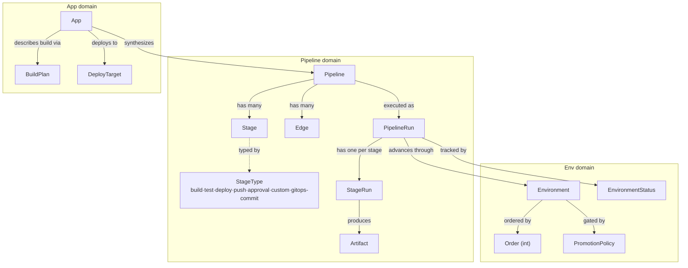
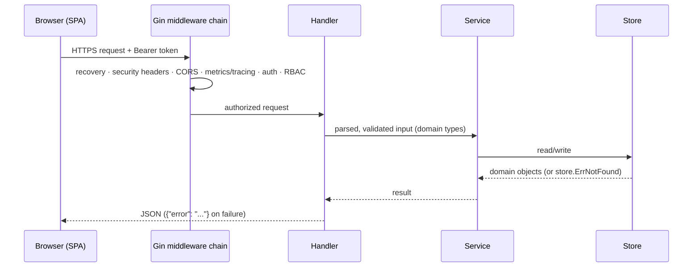
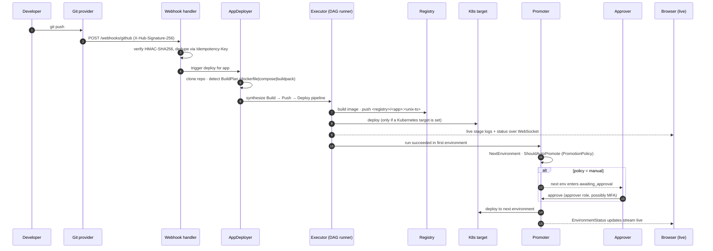

# 01 · Overview

> **Purpose:** the big picture — what Cooker is responsible for, how its core concepts relate, and
> the single end-to-end "behind the scenes" story that the rest of this folder unpacks. **See also:**
> [`../architecture.md`](../architecture.md) for the canonical component map.

## System boundaries & responsibilities

Cooker is a **single Go binary** that serves both the REST API (`/api/v1`) and the embedded React SPA
on port `8080`. One process, one deployable artifact. The rationale:

- **Operational simplicity** — one container, one health check, one thing to scale.
- **No CORS in the common case** — the SPA is served from the same origin as the API.
- **Atomic releases** — the frontend bundle is embedded in the binary via `//go:embed`, so the UI and
  API are always version-matched.

What's **in scope**: defining pipelines as graphs, executing them (build → push → deploy), managing
apps/environments/hosts, streaming live logs, and promoting releases through ordered environments.

What's **out of scope** / delegated: building images is delegated to a pluggable backend (Docker /
Kaniko / Buildah / BuildKit); registries and Kubernetes clusters are external; identity is delegated to
an OIDC IdP (or local auth in dev/UAT).

## Core concepts and how they relate

- A **Pipeline** is a DAG: **Stages** (nodes) connected by **Edges** (directed, optionally conditional).
- Executing a pipeline creates a **PipelineRun**, which holds one **StageRun** per stage.
- An **App** is a shortcut: from a source repo + a **BuildPlan**, Cooker *synthesizes* a pipeline.
- A run advances through user-defined ordered **Environments**, gated by **PromotionPolicy**.

## Request lifecycle (synchronous reads/writes)

Expensive, long-running actions (run a pipeline, build an image, deploy an app) do **not** block the
request. They return **202** immediately and the SPA tails progress over a WebSocket — see
[07-realtime-and-concurrency.md](07-realtime-and-concurrency.md).

## Behind the scenes: one change, end-to-end

This is the spine of the whole system — how a single source change becomes a running deployment and
then climbs the environment chain. Each numbered step links to the doc that explains its mechanics.

**In prose:**

1. A developer pushes. The Git provider fires a webhook to `/webhooks/github` (or `gitlab`/`bitbucket`).
2. The webhook handler **verifies the HMAC signature** and **deduplicates** via the idempotency key
   (`X-GitHub-Delivery` fallback) — see [02-backend.md](02-backend.md) "How Cooker manages the API".
3. `AppDeployer` clones the repo and **detects the BuildPlan** — `dockerfile`, `compose`, or
   `buildpack` — then **synthesizes a pipeline**: Build → Push → Deploy (the Deploy stage is included
   only when the app has a Kubernetes target). The image tag is `<registry>/<app>:<unix-ts>`.
4. The `Executor` runs the synthesized DAG level-by-level (see
   [07-realtime-and-concurrency.md](07-realtime-and-concurrency.md)), pushing the image and deploying.
5. Progress streams to the browser over a WebSocket the entire time.
6. On success, the `Promoter` resolves the **next environment by `Order`** and consults its
   **PromotionPolicy**: `auto` advances immediately; `manual` puts the next environment into
   `awaiting_approval` until an approver clears the gate — see
   [09-environments-and-promotion.md](09-environments-and-promotion.md).
7. The release climbs the chain — Dev → Staging → Production — with `EnvironmentStatus` tracked at each
   step and streamed live.

## OCI compliance posture

Images are OCI-compliant regardless of which builder backend is selected; the registry push path uses
standard OCI distribution APIs. For the canonical detail on the build/push contracts and how the
backends differ, see [05-extension-points.md](05-extension-points.md) and
[`../architecture.md`](../architecture.md).

---

> _Verified against `main` @ `dd93402` on 2026-05-30. If you change the described behaviour, update this chapter in the same PR._
