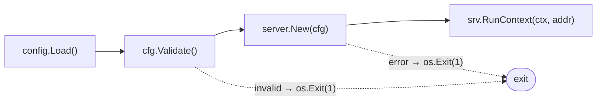
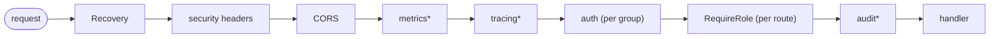
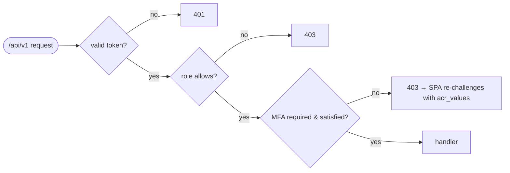
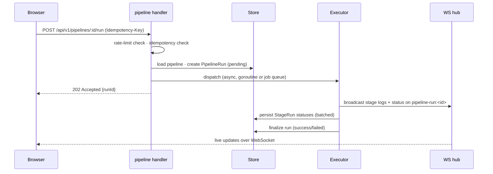

# 02 · Backend (Go)

> **Purpose:** how the Go backend is structured, how it boots, and **how Cooker manages the API**.
> **See also:** [`../design.md`](../design.md) for conventions and the §11 "adding a feature" checklist.

## Layering

The backend obeys one strict rule, top to bottom:

```
handler  →  service  →  store / strategy
```

- **Handlers** (`internal/handler/`) do HTTP parsing only — bind JSON, validate, call a service, write
  a response. No business logic.
- **Services** (`internal/service/`) hold business logic and speak only in domain types
  (`internal/model`). **No HTTP types in services.**
- **Stores** (`internal/store/`) and **strategy adapters** (builder/pusher/deployer/…) implement narrow
  interfaces.

`panic` is allowed only at startup (fail-fast); request paths return wrapped errors.

## Boot sequence

`cmd/cooker/main.go` is deliberately tiny:



`server.New(cfg)` wires the whole system, in order:

1. `gin.New()` + `Recovery()` middleware.
2. Auth (OIDC provider discovery / local JWT issuer).
3. Store selection (Postgres if `DatabaseURL` set, else in-memory).
4. Redis (optional; for multi-replica WS pub/sub + rate limiting).
5. WebSocket hub.
6. Secrets backend (`local` AES-GCM or `keepsave`).
7. Builder / Pusher / Deployer via `selectBuilder` / `selectPusher` / `selectDeployer`.
8. Governance client (optional admission hook).
9. `service.NewExecutor(WithBuilder/WithPusher/WithDeployer/…)`.
10. Job queue (optional) + worker pool.
11. Scheduler (optional; requires job queue).
12. Templates / app-health checker.
13. **Orphan sweep** at boot — marks stale `running` runs failed (`Runs.SweepOrphans`).
14. Late middleware + routes: `securityHeaders → CORS → metrics → tracing`, then `/health*`, then
    `registerRoutes()` (the `/api/v1` group with auth + RBAC).

`RunContext` then starts the HTTP listener, the scheduler tick loop, and the health checker, and wires
graceful shutdown (drain job-queue pool, scheduler, health checker on `SIGINT`/`SIGTERM`).

## Middleware chain



`*` = feature-flagged (metrics, tracing, audit). Auth and RBAC apply to the `/api/v1` group;
`/health*`, `/version`, and `/webhooks/*` are unauthenticated (webhooks self-authenticate via HMAC).

## Handler inventory

One file per domain (`internal/handler/`):

| File | Domain |
|---|---|
| `pipeline.go` | Pipelines + runs (create, run, cancel, promote, approve) |
| `app.go` | Apps + deploy |
| `environment.go` | Environments + per-env secrets |
| `host.go` | Registered hosts |
| `docker.go` | Image build / inspect |
| `registry.go` | Registry credentials |
| `kubernetes.go` | Cluster resources / watch |
| `network.go`, `volume.go` | Docker network/volume management |
| `templates.go` | Pipeline templates |
| `schedules.go` | Cron schedules |
| `notification_targets.go` | Slack/Discord/webhook/email targets |
| `auth_local.go` | Local (non-OIDC) login |
| `webhook_github` / `_gitlab` / `_bitbucket` / `_gitea` | Git provider ingress (HMAC-verified) |

## Service inventory

| Service | Responsibility |
|---|---|
| `Executor` (`executor.go`) | Runs a pipeline DAG, broadcasts logs/status, finalizes the run |
| `AppDeployer` (`app_deployer.go`) | Clone → detect BuildPlan → synthesize Build/Push/Deploy → run |
| `Promoter` (`promoter.go`) | Resolve next env, evaluate policy, advance/approve promotions |
| `JobQueueRunner` (`jobqueue_runner.go`) | Dequeue + execute durable jobs (when queue enabled) |
| `AppHealthChecker` (`app_health.go`) | Periodic app health polling |
| `LogBroadcaster` (`logbroadcast.go`) | Fan-out of stage logs to the WS hub |
| `composeGraph` (`compose_graph.go`) | Compose-file → topology graph |

## Stores

Six interfaces in `internal/store/store.go`: `PipelineStore`, `RunStore`, `EnvironmentStore`,
`AppStore`, `HostStore`, `UserStore`. Two implementations satisfy all six:

- `internal/store/memory/` — dev/test, no external dependency.
- `internal/store/postgres/` — production, with embedded migrations.

Selection is automatic: a set `DatabaseURL` chooses Postgres, otherwise in-memory. **Every store method
must exist in both** — see [04-data-model.md](04-data-model.md).

## How Cooker manages the API

The API is the contract between the SPA (and webhooks) and the backend. Its management properties:

**Versioned surface.** Everything authenticated lives under `/api/v1`. Unauthenticated routes are
`/webhooks/*` (self-authenticating via HMAC), `/health`, `/health/live`, `/health/ready`, and
`/version`. The `/admin/*` group is the same `/api/v1` surface gated to the `admin` role.

**Auth/RBAC gating.** The `/api/v1` group requires a valid Bearer token (OIDC or local JWT). Mutating
routes additionally require a role:



`writeRole` = operator|admin; `adminRole` = admin; approvals require the `approver` role. See
[06-auth-and-security.md](06-auth-and-security.md).

**Idempotency.** Expensive, side-effectful routes (pipeline run, app deploy, all webhooks) honor an
`Idempotency-Key` header (webhooks fall back to `X-GitHub-Delivery`). Only **2xx** responses are
cached, TTL **24h**; a replay returns the cached response with `Idempotency-Replayed: true`.

**Rate limiting.** Three expensive routes are rate-limited per user: `pipelines/:id/run`,
`docker/images/build`, `apps/:id/deploy`. Defaults: **10/min**, burst **3**; over-limit returns
**429** with `Retry-After: 60`. Backend is in-memory token-bucket or Redis sorted-set
(`COOKER_RATE_LIMIT_{ENABLED,PER_MINUTE,BURST,BACKEND}`). Multi-replica requires the Redis backend.

**Consistent error envelope.** Errors are a flat JSON object: `{"error": "<message>"}` — no error code,
no nested object. `store.ErrNotFound` maps to **404**; an optimistic-concurrency conflict maps to
**409** `{"error":"version conflict; refetch and retry"}`.

**OpenAPI.** [`../openapi.yaml`](../openapi.yaml) is a **hand-maintained** OpenAPI 3.1 sketch, not
generated from code. A generated spec is backlog item P8.

## Worked trace: `POST /pipelines/:id/run`



The async dispatch path, batched persistence, and DAG execution are detailed in
[07-realtime-and-concurrency.md](07-realtime-and-concurrency.md).
