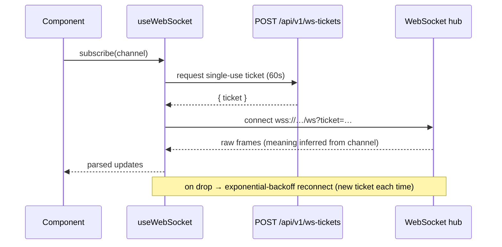

# 03 · Frontend (React SPA)

> **Purpose:** how the single-page app is structured — stores, the graph editor, the API client, and
> the real-time hooks. **See also:** [02-backend.md](02-backend.md) for the API it consumes.

## Stack

React 18 + TypeScript (`strict`) + Vite + Zustand + [`@xyflow/react`](https://reactflow.dev) (graph
canvas) + `oidc-client-ts` (auth). Built to static assets and **embedded into the Go binary**, so the
SPA and API ship as one version-matched artifact.

## Directory map (`frontend/src/`)

```
auth/        OIDCProvider · Callback · ProtectedRoute
api/         typed fetch client + one module per domain
hooks/       useWebSocket · useStageLogs · usePipelineExecution · useKubeWatch
stores/      Zustand stores (one per domain)
pages/       route-level components
components/  pipeline/ · compose/ · layout/ · ui/ + ErrorBoundary · Toast · Skeleton
```

## Auth

`auth/OIDCProvider.tsx` is the linchpin. It supports **both** OIDC (PKCE) and local auth, and exports:

- A React **provider** that wraps the app and exposes auth state to components.
- **Module-level helpers** `getAccessToken()` and `triggerSignIn()` — importantly, these are consumed
  by `api/client.ts` *without* going through React context, so the fetch layer can read the token and
  trigger a sign-in redirect from anywhere. (This is why the codebase keeps `no-explicit-any` off for
  this file — see [11-code-patterns-and-conventions.md](11-code-patterns-and-conventions.md).)

`ProtectedRoute.tsx` is the route guard: it shows a loading state, gates on auth + role, renders an
access-denied state, or renders the route. `Callback.tsx` handles the OIDC redirect return.

## API client

`api/client.ts` is a typed `fetch` wrapper used by every domain module
(`apps.ts`, `pipelines.ts`, `docker.ts`, `kubernetes.ts`, `environments.ts`, `hosts.ts`, `registry.ts`,
`admin.ts`, `settings.ts`, `auth.ts`). It:

- Injects the `Bearer` token from `getAccessToken()`.
- On **401**, triggers a sign-in redirect.
- On **403** that signals an MFA requirement, re-challenges with `acr_values` (step-up MFA).
- Parses the flat `{"error": "..."}` envelope into thrown errors.

**Rule:** no backend URLs in components — all HTTP goes through `api/`.

## Real-time hooks



- `useWebSocket` — the base connection (ticket fetch → connect → backoff reconnect).
- `useStageLogs` — subscribes to a stage's log channel.
- `usePipelineExecution` — tracks a run's live status.
- `useKubeWatch` — streams Kubernetes resource changes.

See [07-realtime-and-concurrency.md](07-realtime-and-concurrency.md) for the channel namespace and the
server side.

## Stores

State that isn't an auth token lives in Zustand (token storage is owned by `oidc-client-ts` inside
`auth/` — **no `localStorage` outside `auth/`**). One store per domain:

| Store | Holds |
|---|---|
| `pipelineStore` | Pipelines, the editing graph, runs |
| `dockerStore` | Images, build state |
| `kubernetesStore` | Cluster resources, watch state |
| `composeStore` | Parsed compose topology |
| `environmentStore` | Environments + statuses |
| `uiStore` | Cross-cutting UI state (panels, selection) |
| `toastStore` | Transient notifications |

## Graph UI

The pipeline editor is the signature feature:

- **`PipelineCanvas`** (`components/pipeline/`) — an `@xyflow/react` canvas with a node component per
  `StageType`: `BuildNode`, `TestNode`, `DeployNode`, `PushNode`, `ApprovalNode`, `CustomNode`, plus a
  generic `StageNode`. Edges can be **conditional** (`success` / `failure` / `always`). Drag-drop add,
  with the graph synced to `pipelineStore`.
- **`NodeConfigPanel`** — edits the selected stage's typed config; `RunHistoryPanel` shows past runs.
- **`ComposeCanvas`** (`components/compose/`) — a read-only topology view of a Docker Compose file.

## Pages

| Group | Pages |
|---|---|
| Apps | `AppsPage`, `AppDetailPage`, `NewAppWizard` |
| Pipelines | `PipelinesPage`, `PipelineEditorPage`, `RunPage`, `TemplatesGalleryPage` |
| Infra | `DockerPage`, `ComposePage`, `KubernetesPage`, `HostsPage` |
| Config | `EnvironmentsPage`, `RegistryPage`, `SchedulesPage`, `NotificationTargetsPage`, `SettingsPage` |
| Auth | `SignInPage`, `SignUpPage` (+ `auth/Callback`) |

## Build tooling

Vite with lazy chunking (the heavy `@xyflow/react` graph is code-split out of the initial bundle) and a
dev proxy to the backend. CI runs `tsc --noEmit`, `npm run lint` (ESLint), `npm run build`, and
`vitest` — see [11-code-patterns-and-conventions.md](11-code-patterns-and-conventions.md).
