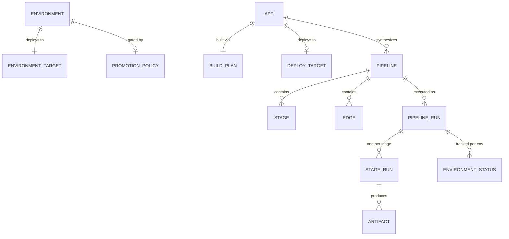
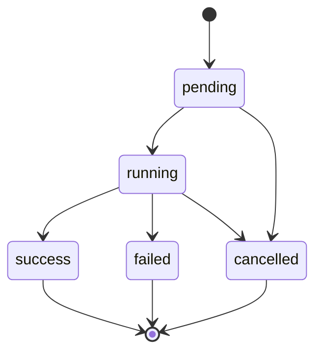
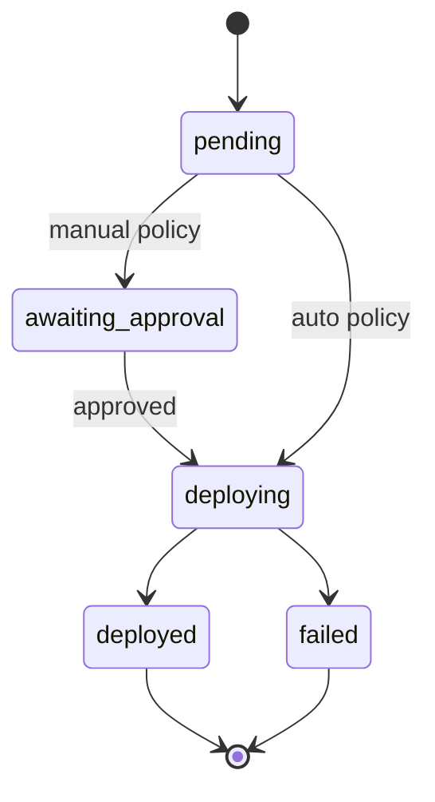
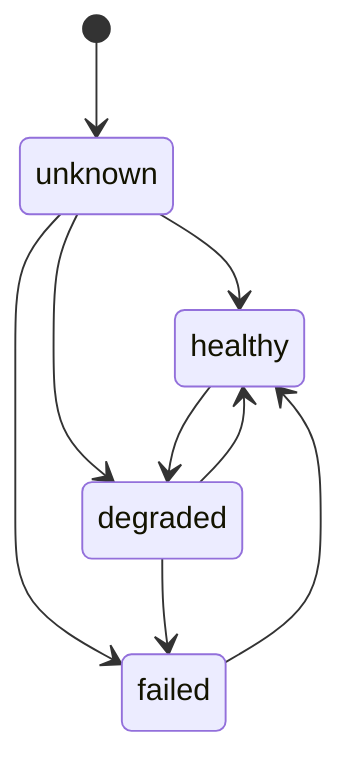
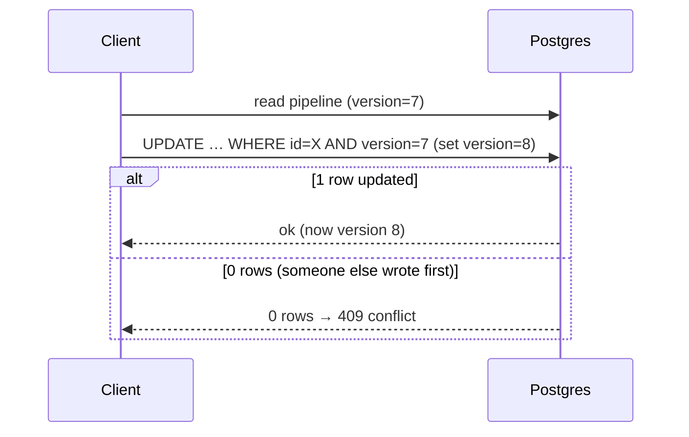

# 04 · Data Model

> **Purpose:** the entities, how they relate, their state machines, and **how Cooker manages the
> database**. **See also:** [ADR-0003](../adr/0003-jsonb-graph-storage.md) for the JSONB decision.

## Entities

| Entity | Key fields | Notes |
|---|---|---|
| **Pipeline** | id, name, stages[], edges[], **version** | The DAG; stored as a JSONB document |
| **Stage** | id, type, config | `type` ∈ build·test·deploy·push·approval·custom·gitops-commit |
| **Edge** | from, to, condition | condition ∈ `success` · `failure` · `always` |
| **PipelineRun** | id, pipelineId, status, stageRuns[], actor | One execution |
| **StageRun** | stageId, status, startedAt, finishedAt | Per-stage record within a run |
| **Artifact** | name, ref/digest | Produced by a stage (e.g. an image) |
| **Environment** | id, name, **order**, target | User-defined tier; sequenced by `order` |
| **EnvironmentTarget** | type, clusterId, namespace, kubeContext | type ∈ cluster · namespace |
| **EnvironmentStatus** | envId, status | Per-env tracking of a run |
| **PromotionPolicy** | strategy, requiredApprovers, autoPromoteOn[] | strategy ∈ `auto` · `manual` |
| **App** | id, repo, buildPlan, deployTarget, **version** | Source repo Cooker builds & deploys |
| **BuildPlan** | kind | kind ∈ `dockerfile` · `compose` · `buildpack` |
| **DeployTarget** | type, … | k8s · cloudrun · ecs · flyio · render |
| **Host** | id, kind, connection | Registered machine/cluster (incl. SSH hosts) |
| **User** | id, subject, roles | From OIDC claims or local auth |

## Relationships

## JSONB-as-document strategy

Pipelines (and other nested structures like per-env secrets) are stored as **JSONB documents**, not
normalized across many tables. The whole graph is read and written atomically. The rationale and
trade-offs are in [ADR-0003](../adr/0003-jsonb-graph-storage.md): the graph is always manipulated as a
unit by the editor, so document storage avoids N-way joins and keeps reads/writes single-row.

## Migration history (001–015)

A custom migration runner (not golang-migrate) applies these in order at boot:

| # | Adds |
|---|---|
| 001 | Initial schema (pipelines, runs) |
| 002 | Per-environment secrets |
| 003 | Apps |
| 004 | Hosts |
| 005 | Users |
| 006 | Run heartbeat (for orphan detection) |
| 007 | Versioning (optimistic-concurrency `version` column) |
| 008 | App health |
| 009 | App deployed URL |
| 010 | Jobs (durable job queue) |
| 011 | Notification targets |
| 012 | Schedules |
| 013 | Pipeline templates |
| 014 | SSH hosts |
| 015 | Pipeline run actor |

## State machines

**Run / StageRun status:**

**EnvironmentStatus (promotion):**

The five `EnvStatus` values are exactly: `pending`, `deploying`, `deployed`, `failed`,
`awaiting_approval`. See [09-environments-and-promotion.md](09-environments-and-promotion.md).

**App health:**

## How Cooker manages the database

**Selection.** A set `DatabaseURL` selects Postgres; otherwise an in-memory store is used (dev/test).
Both implement the same six store interfaces — see [02-backend.md](02-backend.md).

**Migration runner.** Custom, not golang-migrate. SQL files are embedded via `//go:embed
migrations/*.sql`. At boot the runner takes a `pg_advisory_lock` (so only one replica migrates),
records applied versions in a `schema_migrations` table, and applies each pending migration **in its
own transaction**.

**Connection pool.** Defaults: `MaxOpenConns` 25, `MaxIdleConns` 5, `ConnMaxLifetime` 1h — tunable via
`COOKER_DB_{MAX_OPEN_CONNS,MAX_IDLE_CONNS,CONN_MAX_LIFETIME}`.

**Optimistic concurrency.** Four tables carry a `version` column (migration `007`): **pipelines,
environments, apps, and hosts** (not runs). Updates run `UPDATE … WHERE id=$1 AND version=$2`; if 0
rows change, the write lost a race and the store returns `ErrConflict`, which the handler maps to
**409** `{"error":"version conflict; refetch and retry"}`.

**Crash recovery.** A heartbeat updater touches `running` runs (~every 30s). At boot, the **orphan
sweep** (`Runs.SweepOrphans`) marks any `running` run whose heartbeat is older than the threshold as
`failed`, so a crashed replica doesn't leave runs stuck forever. Transient DB errors are retried with
jitter.

---

> _Verified against `main` @ `dd93402` on 2026-05-30. If you change the described behaviour, update this chapter in the same PR._
