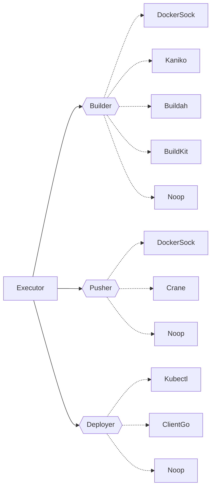
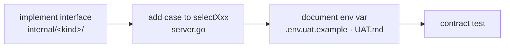

# 05 · Extension Points

> **Purpose:** the pluggable backends and how to add one. **See also:**
> [ADR-0001](../adr/0001-strategy-pattern-interfaces.md) for the strategy-pattern decision and
> [`../design.md`](../design.md) §11 for the "adding a feature" checklist.

## The strategy pattern

Cooker's build/push/deploy/secrets surfaces are **narrow interfaces** with swappable implementations
chosen at startup by an env var. The executor never knows which concrete backend it's calling. This is
how Cooker supports Docker locally and Kaniko/Buildah in a hardened cluster without code changes — see
[ADR-0001](../adr/0001-strategy-pattern-interfaces.md).

## The four execution interfaces

| Interface | Signature | Implementations | Selected by |
|---|---|---|---|
| **Builder** (`internal/builder`) | `Build(ctx, Request) (Result, error)` | `docker` (DockerSock), `kaniko`, `buildah`, `buildkit`, `noop` | `COOKER_BUILDER` (default `noop`) |
| **Pusher** (`internal/pusher`) | `Push(ctx, Request) (Result, error)` | `docker` (DockerSock), `crane`, `noop` | `COOKER_PUSHER` (default `noop`) |
| **Deployer** (`internal/deployer`) | `Deploy(ctx, Request) (Result, error)` | `kubectl`, `clientgo`, `noop` (K8s); `docker-run`, `compose` (Docker host) | `COOKER_DEPLOYER` (K8s); per-service `DeployRuntime` for the Docker pair |
| **Target** (`internal/deploytarget`) | `Deploy(ctx, Spec) error` | k8s · cloudrun · ecs · flyio · render | per-app `DeployTarget.type` |

The wiring lives in `selectBuilder` / `selectPusher` / `selectDeployer` in
`backend/internal/server/server.go`. Each is a small `switch` on the env-var value returning the
concrete type (falling through to `Noop`, which is why the defaults are `noop` — a fresh install does
nothing dangerous until you opt into a real backend).

> **Security note:** the `docker` builder/pusher bind to the host Docker socket. The hardened path is
> `kaniko` / `buildah`, which build rootless in-cluster with no socket. See
> [06-auth-and-security.md](06-auth-and-security.md) and [`../../SECURITY.md`](../../SECURITY.md).

## The secrets interface

Secrets use the same pattern via `selectSecretsManager` (`server.go:580`), implementing
`secrets.Manager`:

| Backend (`COOKER_SECRETS_BACKEND`) | Implementation | Requires |
|---|---|---|
| `database` (default) | `internal/secrets/database` — AES-GCM envelope encryption via `Codec` | `COOKER_SECRET_KEY` (else secret endpoints return **503**) |
| `keepsave` | `internal/secrets/keepsave` | `COOKER_SECRETS_KEEPSAVE_{URL,PROJECT_ID,API_KEY}` |
| `vault` | `internal/secrets/vault` | `COOKER_SECRETS_VAULT_ADDR` (+ token/mount/prefix) |
| `aws` | `internal/secrets/awsm` (AWS Secrets Manager) | region / prefix |
| `gcp` | `internal/secrets/gcpsm` (GCP Secret Manager) | `COOKER_SECRETS_GCP_PROJECT_ID` |

**Secret promotion** is an *optional* capability layered on top: the `secrets.Promoter` interface lets
a backend bulk-copy keys from one environment to the next. Only **KeepSave** implements it; the
`database` backend returns **501** (`ErrPromotionUnsupported`). The route is
`POST /api/v1/environments/:id/secrets/promote` — see
[09-environments-and-promotion.md](09-environments-and-promotion.md).

## Adding a new pluggable backend

The recipe (mirrors [`../design.md`](../design.md) §11):

1. **Implement the interface** in `internal/<kind>/` (e.g. a new pusher in `internal/pusher/`).
2. **Add a `case`** to the relevant `selectXxx` switch in `server.go`.
3. **Document the env-var value** in `.env.uat.example` and [`../UAT.md`](../UAT.md).
4. **Add a contract test** exercising the interface (and keep memory/postgres parity if it touches the
   store).

## Frontend parallel

A new `StageType` on the backend has a frontend counterpart: register a node component under
`frontend/src/components/pipeline/nodes/` and map it in `PipelineCanvas` so the new stage type is
draggable and configurable — see [03-frontend.md](03-frontend.md).

---

> _Verified against `main` @ `dd93402` on 2026-05-30. If you change the described behaviour, update this chapter in the same PR._
