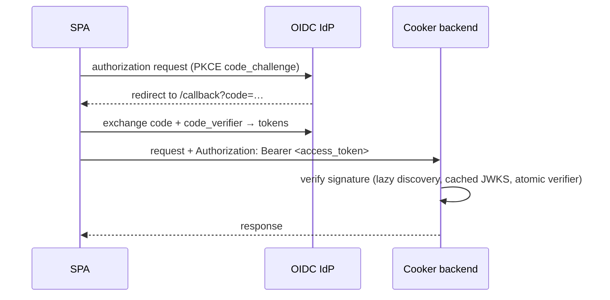
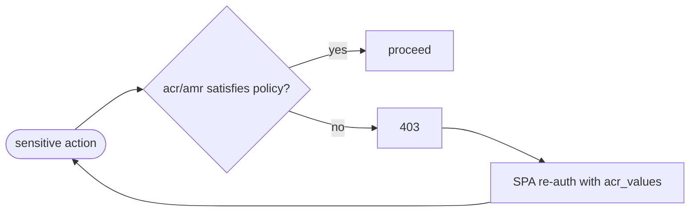
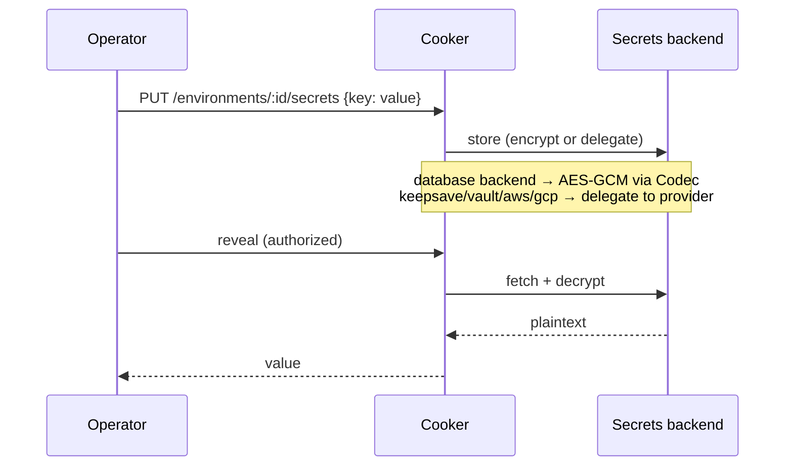

# 06 · Auth & Security

> **Purpose:** how identity, authorization, MFA, and secrets work. **See also:**
> [`../../SECURITY.md`](../../SECURITY.md) — the authoritative threat model. This doc summarizes and
> links there.

## Authentication

Two paths, both ending in a Bearer token on the `/api/v1` group:

**OIDC (PKCE)** — the production path:

The backend discovers the provider lazily, caches and refreshes JWKS, and swaps the verifier
atomically. Group/role mapping comes from `DefaultGroupRoleMap` (IdP groups → Cooker roles).

**Local auth** — a JWT issuer for environments without an IdP (`auth_local.go`, `SignUpPage` /
`SignInPage`). **Dev mode** (`COOKER_OIDC_ENABLED=false`) injects a dev-admin user so the whole app is
usable without any IdP — this is the UAT default and must never be enabled in production.

## RBAC

Four roles (`internal/auth/rbac.go`):

| Role | Capability |
|---|---|
| `admin` | Full access — manage pipelines, deploy to prod, configure settings |
| `operator` | Run pipelines, manage environments |
| `approver` | Narrow role dedicated to promotion approval |
| `viewer` | Read-only |

Most routes are gated by a `RequireRole(...)` **middleware**: `writeRole` = operator|admin, `adminRole`
= admin. **Exception — the `/approve` route.** It carries *no* route-level role middleware; instead the
`ApprovePromotion` handler calls `auth.CanApprovePromotion(claims)` in-handler, which allows **admin OR
approver** (`backend/internal/handler/environment.go`). So "approve" is admin-or-approver, gated in the
handler, not via `RequireRole` like the others. Permission matrix (resource × action → allowed roles):

| Resource | Read | Create/Update/Run | Approve promotion | Admin config |
|---|---|---|---|---|
| Pipelines / Runs | all roles | operator, admin | — | — |
| Apps / Deploy | all roles | operator, admin | — | — |
| Promotions | all roles | operator, admin (promote) | admin or approver (in-handler) | — |
| Environments | all roles | operator, admin | — | — |
| Settings / Users | — | — | — | admin |

## MFA step-up

Sensitive actions can require a stronger authentication context (`acr` / `amr` claims). If the token
doesn't satisfy it, the backend returns **403**, and the SPA re-challenges by re-running the OIDC flow
with elevated `acr_values`:

## Secrets flow

The five secrets backends and their requirements are in
[05-extension-points.md](05-extension-points.md). With the default `database` backend, encryption uses
AES-GCM keyed by `COOKER_SECRET_KEY`; if that key is unset the codec is inactive and secret endpoints
return **503** (fail-safe, not fail-open).

## Threat model — summary

The authoritative threat model is [`../../SECURITY.md`](../../SECURITY.md). Headlines:

| Control | Posture |
|---|---|
| CORS | `Allow-Credentials: true` deliberately **removed**; strict origins in production (gated by `COOKER_ENV`) |
| WebSocket auth | Single-use 60s tickets (`POST /ws-tickets` then `?ticket=`), never the Bearer token on the URL |
| Rate limiting | Per-user on run/build/deploy; Redis backend required for multi-replica |
| Container | Non-root **UID 65532**, read-only-friendly, no `docker.sock` bind-mount in hardened deploys |
| Build isolation | Kaniko/Buildah build rootless in-cluster (closes the docker.sock RCE-to-host gap) |
| Secrets at rest | AES-GCM (database backend) or delegated to a dedicated provider |
| Webhooks | HMAC-verified (see [02-backend.md](02-backend.md)); mismatch → 401 |

When you change anything in this doc's scope, update [`../../SECURITY.md`](../../SECURITY.md) in the
same PR so the threat model stays accurate.

---

> _Verified against `main` @ `dd93402` on 2026-05-30. If you change the described behaviour, update this chapter in the same PR._
