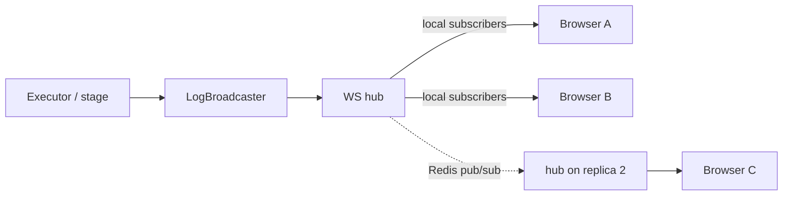
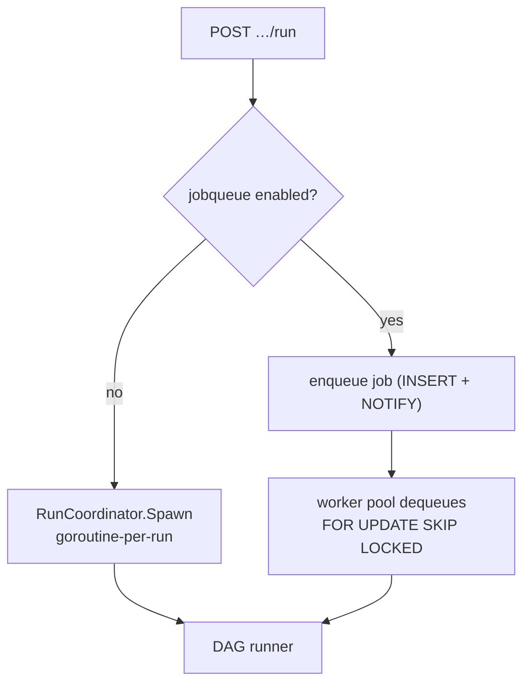

# 07 · Real-time & Concurrency

> **Purpose:** how live updates reach the browser and how Cooker runs work concurrently and safely.
> **See also:** [02-backend.md](02-backend.md) for where runs are dispatched.

## WebSocket: tickets, hub, channels

WebSockets never carry the Bearer token on the URL (it would leak in logs/referrers). Instead the SPA
requests a **single-use, 60-second ticket**, then connects with `?ticket=`:

```mermaid
sequenceDiagram
  participant SPA
  participant API as POST /api/v1/ws-tickets
  participant Hub as WS hub
  SPA->>API: request ticket (authenticated)
  API->>API: mint single-use ticket, TTL 60s
  API-->>SPA: { ticket }
  SPA->>Hub: connect ws://…/ws?ticket=…
  Hub->>Hub: validate + consume ticket
  Hub-->>SPA: subscribed; raw frames follow
```

**Channels** (the client infers meaning from the channel — frames carry the **raw payload**, no JSON
envelope):

| Channel | Carries |
|---|---|
| `pipeline-run:<id>` | Run-level status updates |
| `app-run:<id>` | App-deploy run updates |
| `docker-build:<id>` | Standalone image-build progress |
| `stage-logs:<runId>:<stageId>` | Live per-stage log lines |
| `kube-watch:<ns>:<res>` | Kubernetes resource changes |

> **Note:** the typed `CKR-LOG/1` binary protocol in [`../protocols.md`](../protocols.md) is a
> **proposal**, not implemented. Today's frames are raw payloads.

**Hub backend.** In a single replica the hub is in-memory. For multi-replica, set a Redis backend so
broadcasts fan out across replicas via Redis pub/sub. Ping/pong keepalives detect dead connections.

## Live-log broadcast path



## Concurrency model

A run can be executed two ways depending on whether the durable job queue is enabled:



- **Inline** (default): a goroutine per run via `RunCoordinator.Spawn`, cancellable via context.
- **Durable** (flagged): enqueued to the `jobs` table, picked up by a worker pool — survives restarts.
  See [10-platform-subsystems.md](10-platform-subsystems.md).

**DAG runner** (`pkg/dagrunner`): executes stages **level-by-level** (topological), with bounded
concurrency (`NewRunnerBounded`, `COOKER_DAG_MAX_PARALLEL` default **16**), a per-stage timeout
(default **30m**) plus retries, and edge conditions (`success` / `failure` / `always`) deciding whether
downstream stages run. Status writes are **batched** to reduce DB churn, then the run is finalized.

The race detector is on in CI (`go test -race`) — concurrency code must pass it.

## Background loops

- **Scheduler** — cron triggers fire runs (leader-elected across replicas). See
  [10-platform-subsystems.md](10-platform-subsystems.md).
- **App health checker** — periodically polls deployed apps and updates health status (see the App
  health state machine in [04-data-model.md](04-data-model.md)).
- **Heartbeat + orphan sweep** — keeps `running` runs alive and reaps stuck ones at boot (see
  [04-data-model.md](04-data-model.md)).

## Rate limiting

Per-user limits guard the three expensive routes (`pipelines/:id/run`, `docker/images/build`,
`apps/:id/deploy`): default **10/min**, burst **3**, over-limit → **429** + `Retry-After: 60`.

- **Memory token-bucket** — fine for a single replica.
- **Redis sorted-set** — required for multi-replica, so the limit is global not per-pod.

Configured via `COOKER_RATE_LIMIT_{ENABLED,PER_MINUTE,BURST,BACKEND}`.

---

> _Verified against `main` @ `dd93402` on 2026-05-30. If you change the described behaviour, update this chapter in the same PR._
