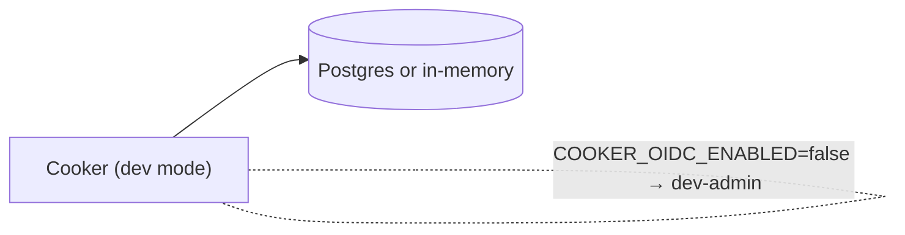
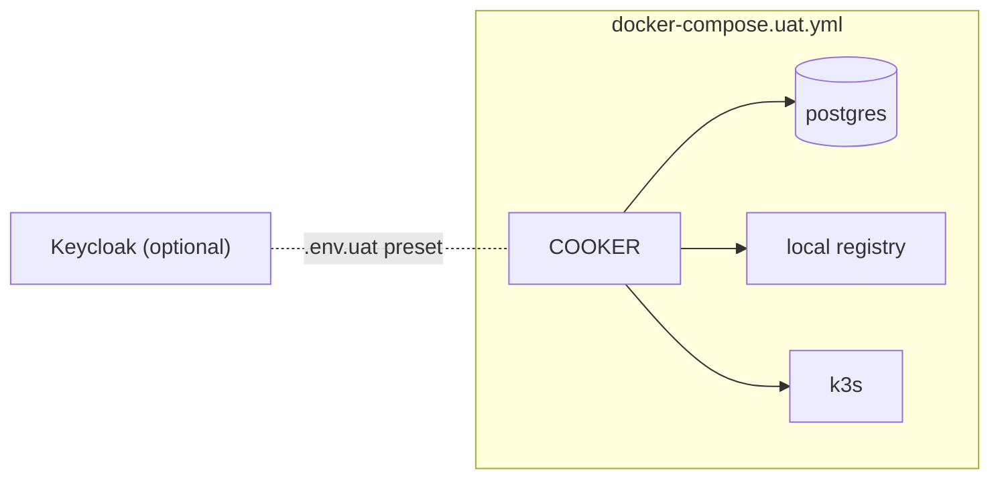
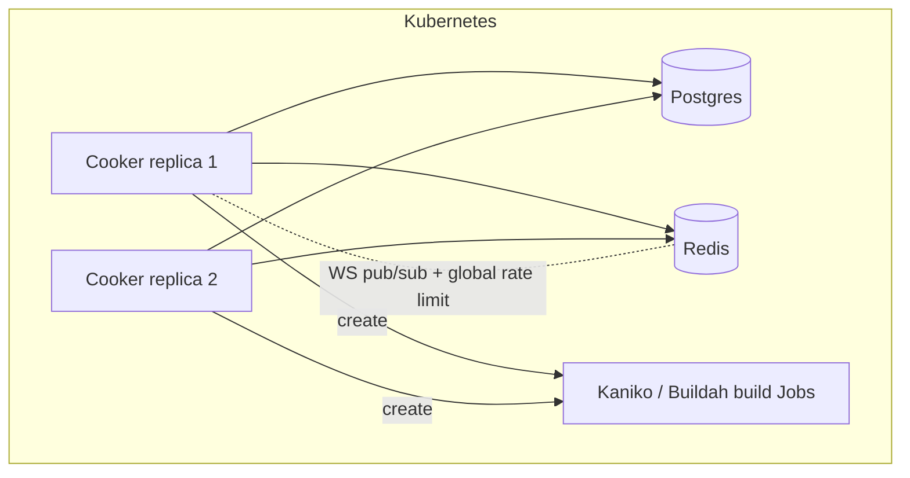

# 08 · Deployment

> **Purpose:** the topology spectrum and the artifacts that ship Cooker. **See also:**
> [`../UAT.md`](../UAT.md), [`../ROLLOUT.md`](../ROLLOUT.md), [`../RUNBOOK.md`](../RUNBOOK.md), and
> [`../../backlog.md`](../../backlog.md) for the honest production-readiness verdict.

## Topology spectrum

Cooker scales from a laptop to a hardened multi-replica cluster. The same binary; different wiring.

### 1. Dev (`docker-compose.yml`)

In-memory store or local Postgres, auth off (dev-admin injected), builders default to `noop`.

### 2. UAT (`make uat-up`)

Brings up postgres + a local registry + k3s + Cooker. The Makefile auto-resolves the host Docker GID
(`group_add`) so the non-root container can reach the socket in UAT. **UAT is auth-off by design**;
enabling OIDC requires a `.env.uat` preset (Google or Keycloak) — never flip `COOKER_OIDC_ENABLED=true`
in the compose file directly. Optional variants: `docker-compose.uat.keycloak.yml`,
`docker-compose.uat.socketproxy.yml`.

### 3. Single host

One container + a managed/standalone Postgres. Real OIDC, a real registry, real builder backend.
Simplest "production-ish" footprint; no horizontal scale.

### 4. Kubernetes HA

Multiple replicas behind a Service, **Redis** for cross-replica WebSocket fan-out and global rate
limiting, Postgres for state, and **Kaniko/Buildah Jobs** for builds — **no `docker.sock`**. The
scheduler leader-elects via `pg_advisory_lock` so only one replica fires cron triggers.

## Container image (`deploy/docker/Dockerfile`)

Multi-stage build: compile the Go binary, build the SPA, embed the SPA into the binary, ship a minimal
final image. Runs as **non-root UID 65532** with a healthcheck. No shell tooling beyond what's needed.

## Helm chart (`deploy/helm/cooker/`)

Values surface includes `cookerEnv` (the `COOKER_*` env block), `secretKeyRef` (OIDC client secret +
`COOKER_SECRET_KEY` sourced from a Secret, never inline), builder selection, pod `securityContext`,
`NetworkPolicy`, ingress TLS, and a retention CronJob — both the securityContext and NetworkPolicy are
**gated by values**. The raw manifests under `deploy/kubernetes/` are kept at **parity** with the chart
for non-Helm users.

## CI/CD (`.github/workflows/ci.yml`)

| Job | Steps |
|---|---|
| Backend | `go build` → `gofmt -l .` → `go vet` → golangci-lint (non-blocking) → `go test -race` (against a Postgres service) |
| Frontend | `npm ci` → `npm run lint` → `npm run build` → `npm test` |
| Helm | `helm lint` → `helm template` guards → `kubeconform` (backlog P6.1) |
| Docker | `docker build` against `deploy/docker/Dockerfile` (+ cosign signing) |

CI runs on PRs to `main` and `claude/**`. See
[11-code-patterns-and-conventions.md](11-code-patterns-and-conventions.md) for which gates are
enforced vs aspirational.

## Production readiness

This system-design folder describes the *design*; it does not certify the system production-ready. The
honest verdict and the open work live in [`../../backlog.md`](../../backlog.md)'s top section — read
that before claiming anything is "done." Operational procedures are in
[`../ROLLOUT.md`](../ROLLOUT.md) and [`../RUNBOOK.md`](../RUNBOOK.md).

---

> _Verified against `main` @ `dd93402` on 2026-05-30. If you change the described behaviour, update this chapter in the same PR._
