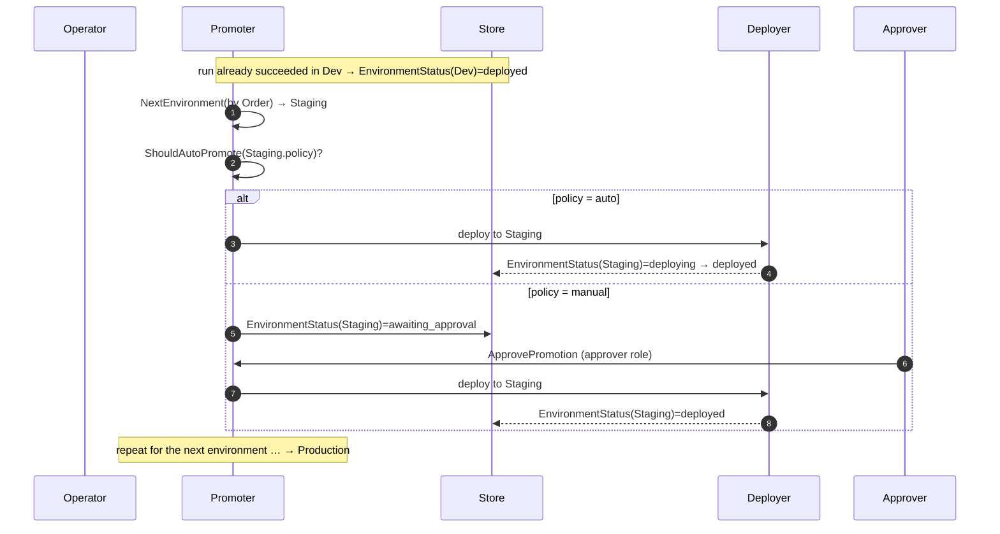
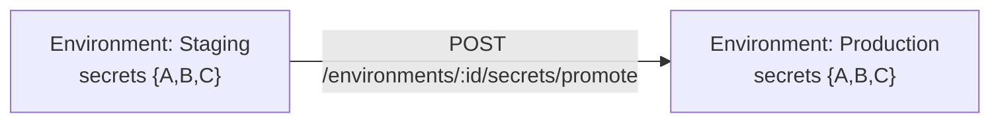

# 09 · Environments & Promotion

> **Purpose:** how a release climbs the environment chain — the "ship code through alpha → beta → prod"
> story, mapped to Cooker's actual model. **See also:** state machines in
> [04-data-model.md](04-data-model.md), RBAC/MFA in [06-auth-and-security.md](06-auth-and-security.md).

## Environments are user-defined and ordered

There are **no hardcoded `alpha`/`beta`/`prod` names** in Cooker. Environments are created by the user
with a `Name` and sequenced by an integer **`Order`** field. "Dev → Staging → Production" is just the
common convention; the chain is whatever you define. Each environment pins to an `EnvironmentTarget`:

| Field | Meaning |
|---|---|
| `type` | `cluster` or `namespace` |
| `clusterId` | Which registered cluster |
| `namespace` | Target namespace |
| `kubeContext` | Kube context to use |

## The Promoter

`internal/service/promoter.go` owns the chain logic:

| Method | Does |
|---|---|
| `NewPromoter` | Construct with stores |
| `NextEnvironment` | Resolve the next environment by `Order` |
| `ShouldAutoPromote` | Consult the env's `PromotionPolicy.Strategy` |
| `Promote` | Advance a run to an environment + write `EnvironmentStatus` |
| `ApprovePromotion` | Clear a manual approval gate |

## Promotion policy

Each environment carries a `PromotionPolicy`:

| Field | Values / meaning |
|---|---|
| `Strategy` | `"auto"` (advance immediately) or `"manual"` (wait for approval) |
| `RequiredApprovers` | How many approvals are needed to clear the gate |
| `AutoPromoteOn` | Conditions under which auto-promotion fires |

The `/promote` and `/approve` routes are RBAC-gated: promoting needs operator|admin; **approving needs
the dedicated `approver` role**, and may require MFA step-up (see
[06-auth-and-security.md](06-auth-and-security.md)).

## End-to-end promotion flow

The `EnvironmentStatus` state machine (`pending → deploying → deployed/failed`, with the
`awaiting_approval` gate) is in [04-data-model.md](04-data-model.md).

## Per-environment configuration & secrets

Each environment has its own config: plain variables (`PlainVars`) and encrypted `Secrets`. When a
release climbs the chain you often want to carry secrets forward — that's **secret promotion**:

Secret promotion is the optional `secrets.Promoter` interface — **only KeepSave implements it** (bulk
copy); the `database` backend returns **501** (`ErrPromotionUnsupported`). See
[05-extension-points.md](05-extension-points.md).

## API routes

| Route | Purpose |
|---|---|
| `POST /api/v1/pipelines/:id/runs/:runId/promote` | Promote a run to the next environment |
| `POST /api/v1/pipelines/:id/runs/:runId/approve` | Clear a manual approval gate (approver) |
| `GET /api/v1/pipelines/:id/runs/:runId/env-status` | Per-environment status of a run |
| `POST /api/v1/environments/:id/secrets/promote` | Copy secrets to the next environment (KeepSave) |

---

> _Verified against `main` @ `dd93402` on 2026-05-30. If you change the described behaviour, update this chapter in the same PR._
