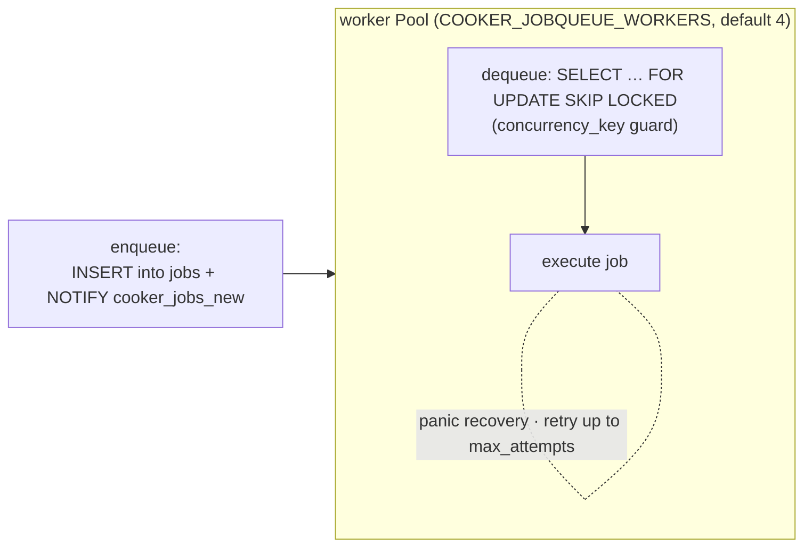
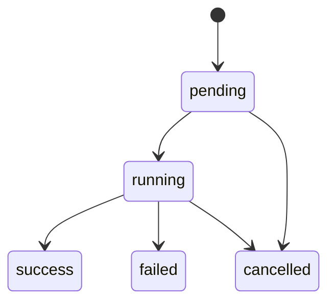
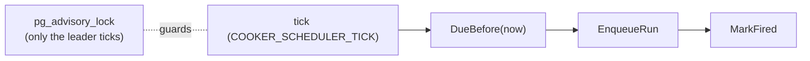
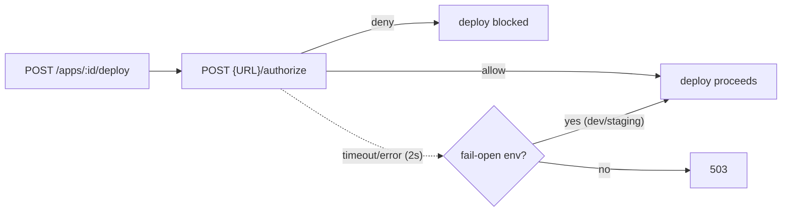

# 10 · Platform Subsystems

> **Purpose:** the additive, **feature-flagged** platform layer — all default-**OFF**. When a flag is
> off, Cooker falls back (e.g. inline run execution instead of the queue). **See also:**
> [`../architecture-phase1-phase2.md`](../reference/architecture-phase1-phase2.md).

These subsystems make Cooker durable and operable at scale, but none is required for the core
build→push→deploy loop. Each is gated by a config flag.

## Durable job queue (`internal/jobqueue/`)

A Postgres-backed work queue so runs survive restarts and spread across workers.

- Flag: `COOKER_JOBQUEUE_ENABLED`.
- `FOR UPDATE SKIP LOCKED` lets many workers pull without contending; `concurrency_key` prevents two
  workers running conflicting jobs.
- Panic recovery + bounded retries (`max_attempts`).

## Run-state FSM (`internal/runstate/`)

Wraps [`looplab/fsm`](https://github.com/looplab/fsm) with the legal transition table:

> **Adoption note:** the executor still writes statuses directly today; the FSM is in place but not yet
> the single source of transition enforcement.

## Scheduler (`internal/scheduler/`)

In-house cron — **5-field only** (no `@daily` macros, no `L`/`W`), IANA-timezone-aware. Crucially, it
**leader-elects via a session-scoped `pg_advisory_lock`** so only one replica fires a given schedule.

- Flags: `COOKER_SCHEDULER_ENABLED` (requires the job queue), `COOKER_SCHEDULER_TICK`.

## Notifier (`internal/notifier/`)

Fan-out notifications on run/deploy events.

- Targets table: `notification_targets`; kinds: `slack` · `discord` · `webhook` · `email`.
- Events: `run.succeeded/failed/cancelled`, `deploy.succeeded/failed`, `build.failed`.
- Dispatcher fans out with a per-target timeout. **Delivery failures are logged, never fail the run.**

## Audit logging (`internal/server/middleware_audit.go`)

Per-route opt-in structured `slog` trail: user, route, method, status, duration — with a redaction
allowlist so secrets/tokens don't land in logs. See [`../../SECURITY.md`](../../SECURITY.md).

## Observability (`internal/observability/`)

- **Metrics** — Prometheus `cooker_*` series; gated by `COOKER_OBSERVABILITY_METRICS_ENABLED`.
- **Tracing** — OpenTelemetry OTLP + `otelgin`; gated by `COOKER_OBSERVABILITY_TRACING_ENABLED`.
- **Logs** — structured `log/slog` throughout.

Wired as middleware early in the chain (see [02-backend.md](02-backend.md)).

## Governance (`internal/governance/`, Phase-4)

An external admission hook on app deploys:

- Flags: `COOKER_GOVERNANCE_*`. Client timeout **2s**.
- Fail-open environments default to `dev,staging`; elsewhere a hook failure fails **closed** (503).
- Bootstrap-services bypass + break-glass exist for recovery.
- **Limitation:** only app-deploy is gated today; pipeline-defined deploys aren't gated yet (v1.1).

## Multi-tenancy status

Designed in [ADR-0004](../adr/0004-multi-tenancy.md) (**Accepted**, Q4-2026) but **not implemented** —
resources are effectively single-tenant today. Don't assume tenant isolation exists.

---

> _Verified against `main` @ `dd93402` on 2026-05-30. If you change the described behaviour, update this chapter in the same PR._
