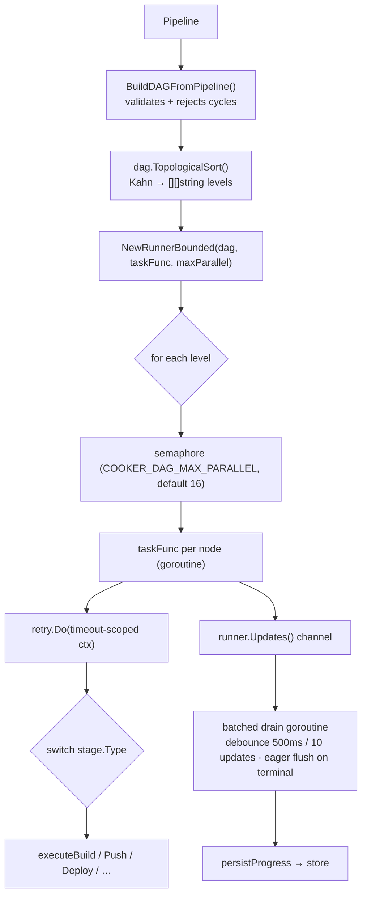
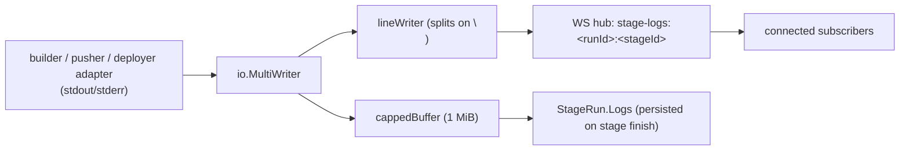

# 13 · Execution Pipeline — DAG, Logging & Tracing

> **Purpose:** the verified current state of the three subsystems that turn a pipeline into a running
> deployment: the **DAG runner**, **live logging**, and **tracing/observability**. This is the
> accurate baseline for any redesign. **See also:** the existing 20-week DAG plan in
> [`../dag-adaptation-2026.md`](../dag-adaptation-2026.md), the perf audit in
> [`../audits/dag-performance.md`](../audits/dag-performance.md), and the redesign proposal in
> [`../execution-observability-redesign-2026.md`](../execution-observability-redesign-2026.md).

> **Why this chapter exists:** two earlier informal analyses contained stale claims (e.g. "push/deploy
> have no live logs", "edge conditions are silently ignored"). Everything below was re-verified against
> source on 2026-05-30. Where reality differs from intuition, this chapter says so.

## DAG execution

### How it works today

- **Topological, level-by-level.** `dagrunner` runs Kahn's algorithm to group nodes into levels; each
  level runs in parallel, levels run in sequence (`backend/pkg/dagrunner/dag.go`, `runner.go`).
- **Bounded fan-out.** `NewRunnerBounded` caps concurrency per level with a `chan struct{}` semaphore;
  `COOKER_DAG_MAX_PARALLEL` (default 16) sets the cap (`0` = unbounded legacy mode).
- **Cycle detection is upfront.** `BuildDAGFromPipeline` refuses a cyclic graph before any work starts.
- **Per-stage timeout + retry.** Each node runs under a `time.ParseDuration(stage.Config.Timeout)`
  deadline (default 30m) wrapping `retry.Do` (jittered exponential backoff, initial 1s, max 15s). Test,
  approval, and custom stages are pinned to `MaxAttempts=1`.
- **FSM-gated transitions.** Status changes route through `internal/runstate` (wraps `looplab/fsm`),
  with a safe fallback to direct assignment on an illegal transition. The FSM **is** used today for
  pending→running→terminal (this corrects the chapter-10 "not yet enforced" note for the executor path).
- **Batched persistence.** A single drain goroutine consumes `runner.Updates()` and writes at most once
  per 500ms / 10 transitions, flushing eagerly on a terminal status.
- **Panic safety.** Each node's goroutine recovers panics and converts them to a stage failure — no
  process crash.

### Foundation already landed (tidy-first T1–T5)

All five "tidy-first" refactors from [`../dag-adaptation-2026.md`](../dag-adaptation-2026.md) §6 are
**implemented on `main`** (verified):

| Item | What it did | State |
|---|---|---|
| **T1** | Stub `test`/`approval`/`custom` stages **fail loud** (`return fmt.Errorf("stage type %q not implemented")`) instead of silently passing | ✅ done |
| **T2** | `LogWriter` wired for **push and deploy** (not just build) | ✅ done |
| **T3** | Removed the redundant status-drain goroutine | ✅ done |
| **T4** | `Edge.Condition` other than `""`/`"success"` is **rejected at validation** (forward-compat refusal) | ✅ done |
| **T5** | Batched `persistProgress` via the `Updates` channel | ✅ done |

### Real gaps (designed, not yet built)

These are the five **primitives** in [`../dag-adaptation-2026.md`](../dag-adaptation-2026.md) §4 —
fully designed, with model fields, ADRs, and a 20-week plan, but not yet implemented:

1. **Conditional edges / trigger rules** — `failure`/`always` edges are *refused* today (not silently
   ignored). No cleanup/failure-handler stages yet.
2. **Inter-stage outputs** — a Push can't read a Build's digest programmatically; it falls back to a
   hand-set `Config.Image` → staleness risk. (Highest-value correctness gap.)
3. **Retry policy depth** — only a single `Retries int`; no per-error classification or backoff knobs.
4. **Build caching** — Kaniko/BuildKit cache flags not surfaced; every build is a cold start.
5. **Post-stage hooks** — no `post { success/failure/always }` equivalent.

The one open decision the project owes (per that doc's §12) is **DR-4** — edge-enum vs stage-boolean
for trigger rules.

## Logging (run / stage logs)

### How it works today

- **Live streaming works for build, push, and deploy** — `executeBuild`, `executePush`, and
  `executeDeploy` each wire `io.MultiWriter(cappedBuffer, lineWriter)` (this corrects the earlier
  "push/deploy have no logs" claim). Only `executeTest` doesn't (it's a near-noop).
- **Line-by-line broadcast.** `lineWriter` splits on newline and publishes each complete line to the
  hub channel `stage-logs:<runId>:<stageId>`; partial lines buffer until the next write/flush.
- **Final persistence.** On stage finish, the capped buffer (1 MiB, truncation-marked) is written to
  `StageRun.Logs`, retrievable via the REST API.
- **Backpressure = drop.** A slow subscriber whose send channel fills is dropped (non-blocking,
  best-effort); the executor never blocks on log delivery.

### Real gaps

- **No replay / history over WebSocket.** Connect mid-run → you only get *future* lines. Refresh after
  a stage ends → the live stream is gone; you must hit the REST API for `StageRun.Logs`. There's no
  ring buffer and no "send me lines since N".
- **Silent drops.** A dropped slow client gets no "stream interrupted" marker.
- **Multi-replica.** With the in-memory hub, a client only sees stages running on *its* replica; the
  Redis pub/sub backend fans out across replicas but still doesn't replay backlog.
- **No envelope.** Frames are raw payloads — no `{ts, stageId, lineNo}` — which makes ordered replay
  ambiguous.

These are addressed in the proposal: [`../execution-observability-redesign-2026.md`](../execution-observability-redesign-2026.md).

## Tracing & observability

### How it works today

- **HTTP auto-spans.** `otelgin.Middleware` wraps every request; OTLP gRPC exporter; W3C
  `TraceContext` + `Baggage` propagators (`backend/internal/observability/`).
- **Context carried across goroutines.** The runner injects the parent span context into a
  `MapCarrier` and each node goroutine extracts it back, so concurrent stages link to the right trace.
- **Metrics.** A solid set of `cooker_*` Prometheus series, including
  `cooker_pipeline_stage_duration_seconds{type,status}`, HTTP request counters/histograms, DB/Redis/JWKS
  error counters, job-queue depth/attempts/duration, and notifier outcomes.
- **Structured logs.** JSON `slog` to stderr; a run-scoped logger threaded via `ctx`.
- **Gating.** Tracing and metrics are off by default
  (`COOKER_OBSERVABILITY_TRACING_ENABLED` / `_METRICS_ENABLED`).

### Real gaps

- **No explicit spans in the hot path.** A trace shows `POST /runs` took 5 minutes but has **no child
  spans** for build/push/deploy — the runner propagates span *context* but never *starts* spans.
- **No propagation into in-cluster builders.** Span/baggage isn't injected into Kaniko/Buildah Jobs, so
  in-cluster build work can't link back to the run trace.
- **Operational.** No sampling config; `/metrics` is unauthenticated.

Addressed in the proposal: [`../execution-observability-redesign-2026.md`](../execution-observability-redesign-2026.md).

## Overall assessment

| Subsystem | Engine quality | What's missing | Verdict |
|---|---|---|---|
| **DAG** | Sound (topo sort, bounded fan-out, retry/timeout, FSM, panic-safe) | Conditional edges, outputs, retry depth, caching, post-hooks — **already designed** in `dag-adaptation-2026.md` | Extend per the existing plan; don't rewrite the engine |
| **Logging** | Live path works for all three execution stages | History/replay, drop signalling, cross-replica continuity | The one genuine *defect*; see the proposal |
| **Tracing** | Correct but minimal (HTTP spans + good metrics) | Execution spans, builder propagation, sampling | Additive extension, not a redesign |

---

> _Verified against `main` @ `dd93402` on 2026-05-30. If you change the described behaviour, update this chapter in the same PR._
