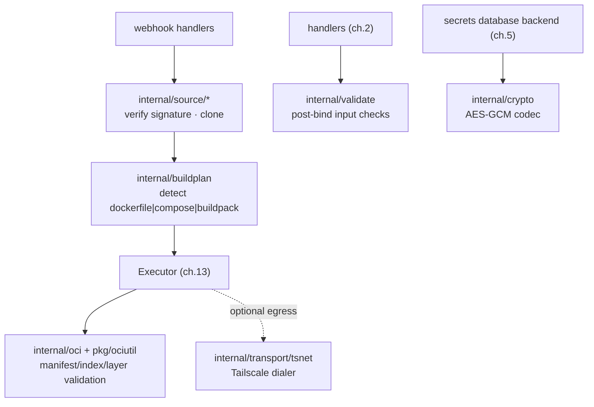

# 15 · Supporting Subsystems

> **Purpose:** the cross-cutting packages that the executor, handlers, and webhooks lean on but that
> don't fit the main chapters — OCI validation, git source-clone + webhook verification, the secret
> codec, build-plan detection, input validation, and the Tailscale transport. These were surfaced by a
> documentation-coverage audit as real, in-use code with no prior home in this set.

## internal/oci + pkg/ociutil — OCI compliance

The OCI image-spec v1.1 types and validators that back Cooker's "OCI-compliant" claim
(`backend/internal/oci/`, ~604 LOC; `backend/pkg/ociutil/`, ~153 LOC).

- **`oci/manifest.go`, `index.go`** — types mirroring `opencontainers/image-spec` v1.1, plus
  `ValidateManifest` / `ValidateIndex` (return a list of problems).
- **`oci/mediatype.go`** — the canonical OCI media-type constants + `IsOCIManifest`.
- **`oci/layer.go`** — `ComputeDigest(r)` → `("sha256:<hex>", size)` in OCI form.
- **`pkg/ociutil/descriptor.go`** — `ParseManifest`, `ParseIndex`, `TotalLayerSize` descriptor helpers
  (in `pkg/` because they're import-safe for external consumers).

Used by the registry read path and anywhere a pushed artifact's manifest is inspected.

## internal/source/* — git clone + webhook verification

Per-provider source handling (`backend/internal/source/{github,gitlab,bitbucket,gitea}/`). Two jobs:

1. **Webhook signature/token verification** — each provider's auth model is different and is
   implemented separately:
   - **GitHub / Bitbucket / Gitea:** HMAC-SHA256 over the body, compared constant-time against the
     app's stored secret (`X-Hub-Signature-256` = `sha256=<hex>`).
   - **GitLab:** a literal `X-Gitlab-Token` header, constant-time compared (GitLab doesn't HMAC).
2. **Clone** — `source/github/clone.go` fetches the repo for `AppDeployer` before build-plan detection.

This is the **authentication boundary for the unauthenticated `/webhooks/*` routes** (see ch.2 / ch.6),
so it's security-relevant despite being "just" plumbing.

## internal/buildplan — build-plan detection

`backend/internal/buildplan/detect.go` (~126 LOC) inspects a cloned source dir and picks how to build
it, with fixed precedence: **Dockerfile → docker-compose → Paketo buildpacks**. This is the
`detect BuildPlan` step in the end-to-end narrative (ch.1) and what `AppDeployer` calls before
synthesizing the Build→Push→Deploy pipeline.

## internal/crypto — secret codec

`backend/internal/crypto/codec.go` (~176 LOC) is the **AES-GCM** sealer behind the `database` secrets
backend (ch.5/ch.6). Values are sealed with a 32-byte key decoded from `COOKER_SECRET_KEY` (base64).
**Without a key the codec is inactive and the secrets endpoints return 503** — the fail-safe noted in
the reality-check (ch.12). `crypto.NewCodec` is constructed in Phase 1 of boot (ch.2), before the
router.

## internal/validate — centralized input validation

`backend/internal/validate/validate.go` (~262 LOC) holds the per-field validators handlers call
post-bind, returning a 400 on the first failure: `Name`, `Description`, `StageType`, `HostKind`,
`HostReachability`, `EnvironmentTargetType`, `GitHubRepo`, `GitRefName`, `DockerTag(s)`, and more. It's
the reason handlers stay thin (ch.2 layering) — validation lives here, not inline in each handler.

## internal/transport/tsnet — Tailscale transport

`backend/internal/transport/tsnet/` exposes a `Dialer` that routes outbound connections through a
Tailscale tailnet Cooker joins agentlessly (`tailscale.com/tsnet`). It is **build-tag gated**:

- Default builds (no `-tags tsnet`) link `stub.go`, whose `New` returns `ErrDisabled`.
- Production builds with `-tags tsnet` link `real.go`.
- Also requires `COOKER_TAILSCALE_AUTHKEY`.

This lets Cooker reach private registries / clusters over a tailnet without a public ingress. Because
it's off unless explicitly compiled in, it's listed here rather than as a first-class deploy mode.

## Why these live here

None of these is a "feature" a user selects; they're the connective tissue. They're documented for
contributor completeness — a reviewer auditing "is every in-use package described somewhere?" should
find them. For the feature-flagged *platform* subsystems (queue, scheduler, notifier, audit,
observability, governance) see [10-platform-subsystems.md](10-platform-subsystems.md).
