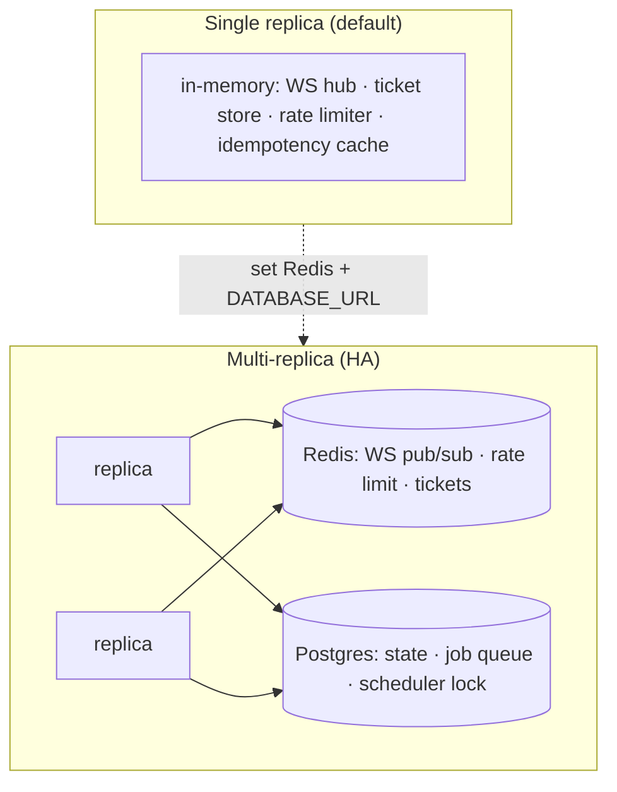

# 16 · Non-Functional Characteristics

> **Purpose:** the operational envelope — tunables, defaults, scale limits, and the single-replica vs
> multi-replica boundary. Every number below is the in-code default (verified against source), not an
> aspiration. **See also:** [`../MULTI_REPLICA.md`](../MULTI_REPLICA.md),
> [`../ROLLOUT.md`](../ROLLOUT.md), [`../RUNBOOK.md`](../RUNBOOK.md).

> **Honesty note:** Cooker does **not** publish formal SLOs (availability %, p99 latency targets) today.
> This chapter documents the *mechanisms and limits* that determine performance, not contractual
> targets. Treating these as SLOs would be aspirational; see "What's not defined" at the end.

## Tunables & defaults (verified)

| Concern | Default | Env var | Source |
|---|---|---|---|
| DB max open conns | **25** | `COOKER_DB_MAX_OPEN_CONNS` | `store/postgres/store.go` |
| DB max idle conns | **5** | `COOKER_DB_MAX_IDLE_CONNS` | `store/postgres/store.go` |
| DB conn max lifetime | **1h** | `COOKER_DB_CONN_MAX_LIFETIME` | `store/postgres/store.go` |
| Rate limit (expensive routes) | **10/min**, burst **3** | `COOKER_RATE_LIMIT_PER_MINUTE` / `_BURST` | `config.go` |
| Rate-limit backend | `memory` | `COOKER_RATE_LIMIT_BACKEND` | `config.go` |
| DAG intra-level parallelism | **16** | `COOKER_DAG_MAX_PARALLEL` | `service/executor.go` |
| Per-stage timeout | **30m** | per-stage `config.timeout` | `service/executor.go` |
| Job-queue workers | **4** | `COOKER_JOBQUEUE_WORKERS` | `config.go` |
| Scheduler tick | **30s** | `COOKER_SCHEDULER_TICK` | `config.go` |
| WebSocket ticket TTL | **60s**, single-use | (constant) | `server/wsticket.go` |
| Idempotency cache TTL | **24h**, 2xx only | (constant) | `server/middleware_idempotency.go` |
| Per-stage log cap | **1 MiB** (truncation-marked) | (constant) | `service/executor.go` |

## Scale model

**The single→multi boundary is the load-bearing operational fact.** Several subsystems default to
**in-memory** and are therefore *per-replica* unless you switch them to Redis/Postgres:

| Subsystem | Single-replica default | Multi-replica requirement |
|---|---|---|
| WebSocket hub | in-memory fan-out | `COOKER_WS_HUB_BACKEND=redis` (else a client only sees runs on *its* replica) |
| WS ticket store | in-memory | `COOKER_WS_TICKET_BACKEND=redis` (else a ticket issued by replica A is invalid on B) |
| Rate limiter | in-memory token bucket | `COOKER_RATE_LIMIT_BACKEND=redis` (else the limit is per-pod, not global) |
| Idempotency cache | in-memory, per-replica | no shared backend today → a retry hitting a different replica isn't deduped |
| Job queue | n/a (off) | Postgres `jobs` table + `NOTIFY`; safe across replicas via `FOR UPDATE SKIP LOCKED` |
| Scheduler | n/a (off) | leader-elected via `pg_advisory_lock` — only one replica fires |

## Throughput & concurrency characteristics

- **Run execution:** inline goroutine-per-run by default; bounded by `COOKER_DAG_MAX_PARALLEL` (16)
  *within* a DAG level. With the durable job queue enabled, throughput is bounded by
  `COOKER_JOBQUEUE_WORKERS` (4) per replica × replica count.
- **DB connections:** `MaxOpenConns` (25) **× replica count** must stay under Postgres's
  `max_connections` — the dominant capacity ceiling in HA (see `store/postgres/store.go` comments).
- **Async by design:** run/build/deploy return **202** immediately and stream progress over WebSocket,
  so request latency is decoupled from job duration (see ch.7).

## Availability & recovery

- **Liveness/readiness:** `/health/live`, `/health/ready` (readiness checks store/redis) — ch.14.
- **Crash recovery:** heartbeat (~30s) + boot-time **orphan sweep** marks stale `running` runs failed
  so a crashed replica doesn't strand them (ch.4).
- **Graceful shutdown:** `RunContext` drains the job-queue pool, scheduler, and health checker on
  `SIGINT`/`SIGTERM` (ch.2).
- **Retry/backoff:** transient DB errors retried with jitter (ch.4); per-stage retry is
  jittered-exponential (ch.13).

## Resource & security posture (operational)

- Container runs **non-root UID 65532**, read-only-friendly; no `docker.sock` in hardened builds
  (ch.6, ch.8).
- Secrets sealed AES-GCM at rest (database backend) or delegated to a provider (ch.5).
- Per-stage log cap (1 MiB) keeps the `stage_runs` JSONB bounded (ch.13).

## What's *not* defined (gaps a tech lead should know)

- **No published SLOs** — no availability %, no p50/p99 latency or run-throughput targets.
- **No load-test baseline** in-repo — the numbers above are limits/defaults, not measured capacity.
- **Idempotency is per-replica** — not shared via Redis today, so cross-replica retry dedupe isn't
  guaranteed (noted in ch.7 / ch.12).
- **No autoscaling guidance** beyond the connection-ceiling math above.

These are honest omissions, not hidden ones — capturing them here is the point of this chapter.

---

> _Verified against `main` @ `dd93402` on 2026-05-30. If you change the described behaviour, update this chapter in the same PR._
