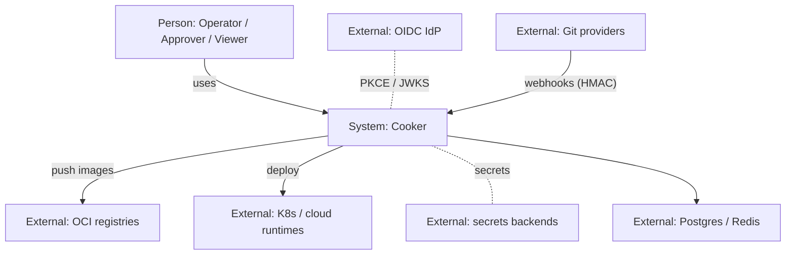
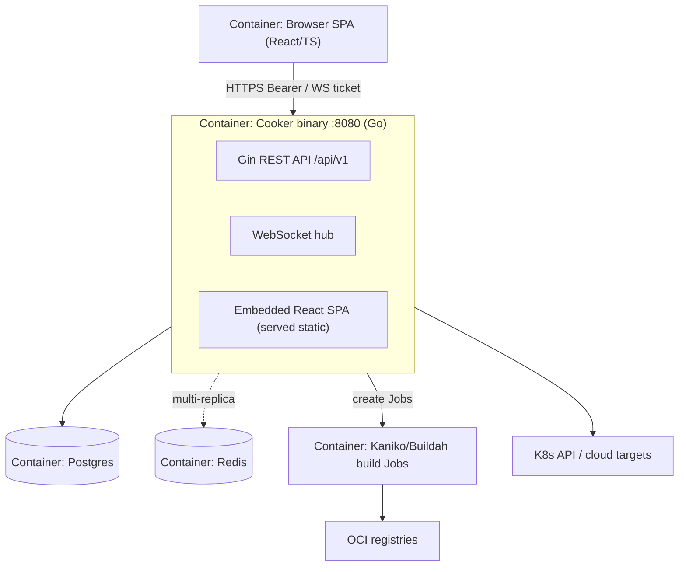
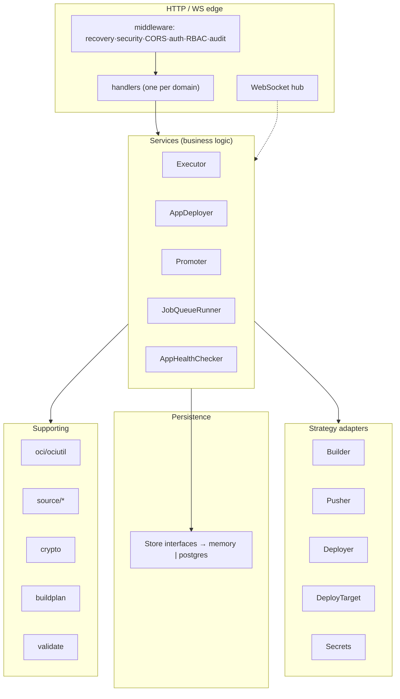

# 17 · C4 Model

> **Purpose:** the [C4 model](https://c4model.com) view of Cooker — the same system the other chapters
> describe, organized by the four C4 levels so a reader can zoom from "who uses it" down to "which
> package." This chapter **names the levels and points into the detailed chapters**; it doesn't
> duplicate them.

C4 has four levels of zoom: **Context** (system + actors) → **Container** (deployable/runnable units) →
**Component** (the major parts inside a container) → **Code** (classes/packages; we link rather than
draw). Cooker is a single-binary system, so its container diagram is deliberately small — most of the
interesting structure is at the component level.

## Level 1 — System Context

*Who and what Cooker talks to.* The full diagram is in the [README](README.md#system-context).

→ Detail: [01-overview.md](01-overview.md), [06-auth-and-security.md](06-auth-and-security.md).

## Level 2 — Containers

*The runnable/deployable units.* Cooker is intentionally **one process** (single Go binary serving API
+ SPA), so the container count is small; the data stores and build/deploy executors are separate
containers/processes.

| Container | Tech | Responsibility | Chapter |
|---|---|---|---|
| Cooker binary | Go / Gin | API, WebSocket hub, serves SPA | [02](02-backend.md), [07](07-realtime-and-concurrency.md) |
| Browser SPA | React/TS/Vite | Graph editor, live views | [03](03-frontend.md) |
| Postgres | — | State, job queue, scheduler lock | [04](04-data-model.md) |
| Redis (optional) | — | Cross-replica WS pub/sub, rate limit, tickets | [16](16-non-functional.md) |
| Build Jobs | Kaniko/Buildah | Rootless in-cluster image build | [05](05-extension-points.md) |

→ Deployment topologies: [08-deployment.md](08-deployment.md).

## Level 3 — Components (inside the Cooker binary)

*The major internal parts and the layering between them.* This is where most of Cooker's structure
lives.

| Component group | Packages | Chapter |
|---|---|---|
| HTTP edge | `server`, `handler`, middleware | [02](02-backend.md) |
| Services | `service` (Executor/AppDeployer/Promoter/…) | [02](02-backend.md), [13](13-execution-pipeline.md) |
| Strategy adapters | `builder`, `pusher`, `deployer`, `deploytarget`, `secrets` | [05](05-extension-points.md) |
| Persistence | `store` (+ `memory`, `postgres`) | [04](04-data-model.md) |
| Platform (gated) | `jobqueue`, `scheduler`, `notifier`, `audit`, `observability`, `governance` | [10](10-platform-subsystems.md) |
| Supporting | `oci`, `ociutil`, `source/*`, `crypto`, `buildplan`, `validate`, `tsnet` | [15](15-supporting-subsystems.md) |
| Frontend | `api`, `auth`, `hooks`, `stores`, `pages`, `components` | [03](03-frontend.md) |

→ The strict layering rule (handler → service → store/strategy) is in
[11-code-patterns-and-conventions.md](11-code-patterns-and-conventions.md).

## Level 4 — Code

C4's code level (class/package diagrams) is intentionally **not drawn** here — it drifts fastest. Use
the codebase directly, anchored by the `file:line` references throughout chapters
[02](02-backend.md)–[16](16-non-functional.md) and the [API reference](14-api-reference.md). Key design
decisions are in [`../adr/`](../adr/).

## How this maps to the rest of the set

This chapter is a **navigational overlay**, not new content. If you think in C4, start here and zoom in;
if you think by topic, use the [README index](README.md). Both reach the same chapters.

---

> _Verified against `main` @ `dd93402` on 2026-05-30. If you change the described behaviour, update this chapter in the same PR._
