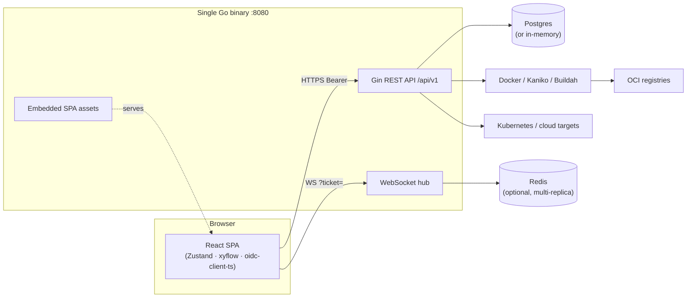
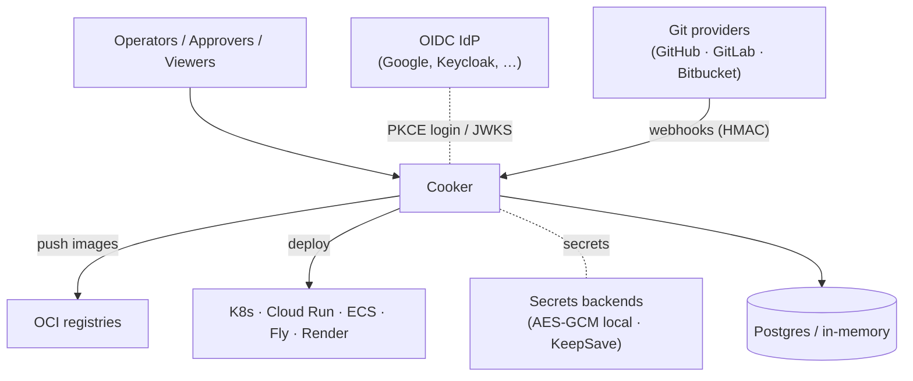

# Cooker — System Design

This folder is the **consolidated, top-to-bottom system design** for Cooker. It ties the whole
system together — front to back, data to deploy — with diagrams and clear navigation. It does **not**
replace the existing reference docs; it sits above them and links down into them for the authoritative
detail.

> **New here?** Read [01-overview.md](01-overview.md) first — it explains what Cooker is and walks one
> change end-to-end ("behind the scenes") from `git push` to production.

## What Cooker is

Cooker is a web-based **CI/CD management tool** with a graph-based UI for visually building pipelines
that build OCI-compliant Docker images, push them to registries, and deploy to Kubernetes across
user-defined ordered environments (e.g. Dev → Staging → Production). A **single Go binary** serves both
the REST API and the React frontend on port `8080`.

## System context

## Navigation

| Doc | Read when |
|---|---|
| [01-overview.md](01-overview.md) | You want the big picture + the end-to-end "behind the scenes" story |
| [02-backend.md](02-backend.md) | You're working in the Go backend, or need "how the API is managed" |
| [03-frontend.md](03-frontend.md) | You're working in the React SPA (stores, graph UI, api client, WS) |
| [04-data-model.md](04-data-model.md) | You need entities, relationships, state machines, or "how the DB is managed" |
| [05-extension-points.md](05-extension-points.md) | You're adding a builder / pusher / deployer / deploy target / secrets backend |
| [06-auth-and-security.md](06-auth-and-security.md) | You're touching auth, RBAC, MFA, or secrets |
| [07-realtime-and-concurrency.md](07-realtime-and-concurrency.md) | You're touching WebSockets, the executor, or rate limiting |
| [08-deployment.md](08-deployment.md) | You're deploying or operating Cooker (dev / UAT / single-host / K8s HA) |
| [09-environments-and-promotion.md](09-environments-and-promotion.md) | You want "how code moves up the chain" (promotion, approvals) |
| [10-platform-subsystems.md](10-platform-subsystems.md) | You're touching the feature-flagged platform layer (queue, scheduler, notifier, audit, observability, governance) |
| [11-code-patterns-and-conventions.md](11-code-patterns-and-conventions.md) | You're writing code and want the patterns, style rules, and PR conventions |
| [12-reality-check.md](12-reality-check.md) | You want the honest list of defaults, gotchas, and what's designed-but-not-yet-real |
| [13-execution-pipeline.md](13-execution-pipeline.md) | You're working on (or redesigning) the DAG runner, live logging, or tracing |
| [14-api-reference.md](14-api-reference.md) | You want the complete list of HTTP + WebSocket endpoints with auth requirements |
| [15-supporting-subsystems.md](15-supporting-subsystems.md) | You're touching OCI validation, git source-clone/webhooks, the secret codec, build-plan detection, input validation, or the Tailscale transport |
| [16-non-functional.md](16-non-functional.md) | You're operating Cooker and need tunables, scale limits, and the single- vs multi-replica boundary |
| [17-c4-model.md](17-c4-model.md) | You think in C4 — Context / Container / Component / Code levels, mapped to the chapters above |

## Glossary

| Term | Meaning |
|---|---|
| **Pipeline** | A graph (DAG) of stages + edges that defines a build/deploy workflow. |
| **Stage** | A node in a pipeline: `build`, `test`, `deploy`, `push`, `approval`, `custom`, or `gitops-commit`. |
| **Edge** | A directed dependency between stages, optionally conditional (`success` / `failure` / `always`). |
| **Run** (`PipelineRun`) | One execution of a pipeline. Contains a `StageRun` per stage. |
| **StageRun** | The execution record + status of one stage within a run. |
| **Environment** | A user-defined deployment target tier, sequenced by an integer `Order`. |
| **Promotion** | Advancing a successful run from one environment to the next by `Order`. |
| **App** | A source repo Cooker can build & deploy via a synthesized pipeline (`BuildPlan`). |
| **DeployTarget** | Where an app is deployed (Kubernetes, Cloud Run, ECS, Fly, Render). |
| **Host** | A registered machine/cluster Cooker can act against. |
| **Ticket** | A single-use 60s token that authorizes a WebSocket connection. |

## Relationship to existing docs

This system-design set **summarizes and links** — it is not the source of truth for everything. When
you need the authoritative detail, follow the pointers:

| Existing doc | Authoritative for |
|---|---|
| [`../architecture.md`](../architecture.md) | The canonical system map (what calls what) |
| [`../design.md`](../design.md) | Feature patterns, conventions, the §11 "adding a feature" checklist |
| [`../../SECURITY.md`](../../SECURITY.md) | The threat model: CORS, WS tickets, rate limiting, container hardening |
| [`../adr/`](../adr/) | Accepted decisions (ADR-0001 strategy pattern, 0002 secrets, 0003 JSONB, 0004 multi-tenancy) |
| [`../architecture-phase1-phase2.md`](../architecture-phase1-phase2.md) | The feature-flagged platform subsystems |
| [`../audits/`](../audits/) | Known bugs, SPOFs, and chain-error findings |
| [`../../backlog.md`](../../backlog.md) | The honest production-readiness verdict and open work |

## Coverage & verification

This set is **package-complete**: every `backend/internal/*`, `backend/pkg/*`, and `frontend/src/*`
package has a home chapter (the supporting/cross-cutting packages — OCI, source-clone, crypto,
buildplan, validate, tsnet — live in [15-supporting-subsystems.md](15-supporting-subsystems.md)).

A tech-lead documentation audit (2026-05) cross-checked the chapters against source: boot sequence,
middleware order, migration list, optimistic-concurrency scope, RBAC matrix, WebSocket channel names,
secrets backends, platform-subsystem config, and route auth gates. Corrections from that audit
(boot-order phases, the 4-table version scope, and the in-handler `/approve` gate) are folded into
chapters 02/04/06/12/14. Claims are written to match `main` as of the audit; when behaviour changes,
update the relevant chapter in the same PR (the reality-check chapter, [12](12-reality-check.md), is
the canonical place for "designed-but-not-real" caveats).

---

> _Index verified against `main` @ `dd93402` on 2026-05-30._
