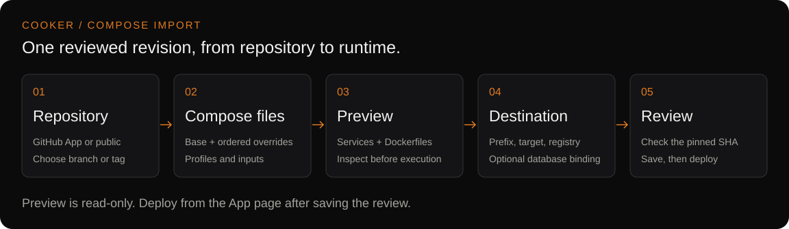

# Cooker user guide

Cooker provides visual pipelines and reviewed GitHub Compose deployments. Its Go
server serves the API and React frontend on port 8080. The current September
`develop` candidate is ready for UAT; live GitHub and cloud acceptance are pending.

## Where to start

| You want to… | Read |
|---|---|
| Explore Cooker locally or start a real UAT stack | [Quickstart](getting-started/quickstart.md) |
| Import Compose from GitHub and deploy a reviewed revision | [GitHub Compose deployment](../guides/GITHUB-COMPOSE-DEPLOYMENT.md) |
| Understand Apps, Pipelines and Environments | [Product concepts](concepts/apps.md) |
| Save and reopen Compose stacks | [Compose library and registries](guides/compose-library.md) |
| Author a custom stage graph | [Your first pipeline](guides/first-pipeline.md) |
| Configure targets | [Hosts and targets](concepts/hosts-and-targets.md) |
| Prepare a production installation | [Helm install](getting-started/helm-install.md) and [Auth & RBAC](operations/auth-and-rbac.md) |
| Configure logs, metrics and tracing | [Observability](operations/observability.md) |
| Diagnose a problem | [Troubleshooting](operations/troubleshooting.md) |

## Current App contract

The import wizard discovers Compose files and Dockerfiles before deployment,
resolves ordered overrides/profiles, and saves a full Git SHA with your prefix and
bindings. Deployment starts from the App page. Reviewed Compose Apps require
explicit reinspection for source updates and use manual deployment.

Source builds require Docker builder + Docker pusher today. Production-mode
validation rejects both, so this App path is for dev/UAT. Image-only plans and
separately authored pipelines still have their own target/configuration checks.
The presence of an adapter does not establish support for every Compose feature.

For ECS plus Cloud SQL, provision infrastructure, database access and networking
separately. Cooker maps an existing external database into the application's
Environment keys; live cross-cloud acceptance remains to be completed.

## Documentation scope

This is the user/operator guide. Contributor architecture lives in the
[system design](../system-design/README.md) and [execution reference](../reference/github-compose-architecture.md).
See [SECURITY.md](../../SECURITY.md) for vulnerability reporting and security
policy. Cooker is pre-1.0; check the [changelog](../../CHANGELOG.md) before upgrading
and use the [UAT runbook](../guides/UAT.md) to accept the behavior you depend on.
