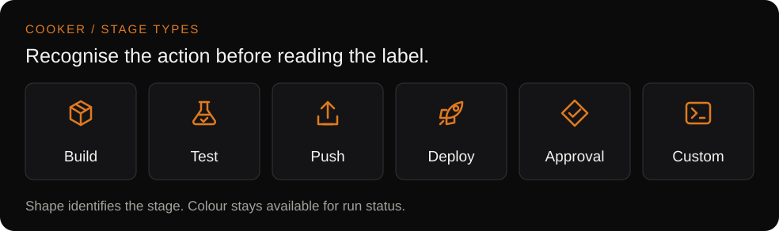

# What is Cooker?

Cooker is an open-source, self-hosted CI/CD application for authoring visual pipelines and deploying reviewed GitHub Compose stacks. A Go server serves the API and React frontend on port 8080. The project is licensed under Apache 2.0.

The current `develop` implementation is ready for UAT. Human acceptance and live GitHub/cloud acceptance remain pending; the September Compose changes are unreleased. See the [changelog](../CHANGELOG.md) and [verification record](plans/2026-09-06-github-compose-deployment.md#verification-record).

## What users do

**Pipelines** provide a graph editor with distinct Build, Test, Push, Deploy, Approval and Custom symbols. Users connect stages, run a pipeline, and inspect execution state and stage logs.

**Apps** provide a repository-to-deployment workflow: choose an approved GitHub repository or public repository, select Compose files and overrides, preview services and Dockerfiles, set a prefix and target, and save the reviewed commit. Deployment starts separately from the App page.

## Current scope

| Capability | Implemented behavior and limits |
|---|---|
| Repository access | Shared administrator-approved GitHub App installations, plus manual public repository entry; separate from Cooker login |
| Compose review | Ordered files, profiles, explicit interpolation, masked configuration and build/dependency details; no build during preview |
| Saved revisions | Full Git SHA pin; explicit reinspection for branch updates; manual deployment for reviewed Compose Apps |
| Compose library | Browser-local file references and server-backed GitHub stacks; no OCI Compose bundle distribution |
| App destinations | Cooker-local Docker, Kubernetes, ECS Fargate and Cloud Run, subject to capability and field diagnostics |
| Source builds | Docker builder + Docker pusher required today; dev/UAT only because production validation rejects these backends |
| External databases | Bind a local Compose service to an existing database using Environment keys; no database or network provisioning |
| AWS application + GCP database | Existing ECS Fargate + existing Cloud SQL mapping implemented; live application/database acceptance pending |
| Authentication | Local authentication and/or OIDC, with role-based permissions; no claim of isolated customer workspaces |
| Operations | Persistent PostgreSQL store, optional Redis backends, health endpoints, stage logs, metrics, traces and audit facilities |

## Deployment expectations

Cooker does not create a VM when ECS is selected. This App path uses Fargate containers on infrastructure the operator configures. It does not create Cloud SQL, networking, IAM roles, load balancers, DNS or Cloud SQL proxy sidecars. Each Compose App uses one compute target and one replica per executable service.

Production-mode validation is a configuration guard, not evidence that every feature has passed production acceptance. Adapter code and fixture tests also do not establish live cloud support for every Compose feature. The selected target's diagnostics and the [setup/UAT guide](guides/GITHUB-COMPOSE-DEPLOYMENT.md) define the supported flow.

## Read next

- [README](../README.md): local start, workflow and project structure.
- [GitHub Compose deployment](guides/GITHUB-COMPOSE-DEPLOYMENT.md): operator configuration and cross-cloud example.
- [Apps, pipelines and environments](user-guide/concepts/apps.md): how the product concepts fit together.
- [Documentation index](README.md): installation, operations and contributor references.
